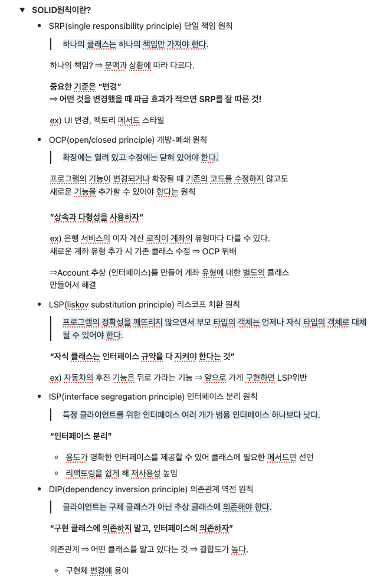

### 피어리뷰 (Spring A팀 미키)



**리뷰 내용**

SOLID 원칙을 예시들과 함께 설명해주니 이해가 잘 되는 것 같습니다!

<hr>

### SOLID원칙이란?

**SOLID 원칙** : 객체 지향 설계에서 지켜줘야 할 5개의 소프트웨어 개발 원칙

 - 높은 응집도와 낮은 결합도
 - SRP와 ISP는 객체가 단일 책임을 가지게 하고 클라이언트마다 특화된 인터페이스를 구현하게 해서 객체가 커지는 것을 막는다
 - LSP와 DIP는 OCP를 돕는다. OCP는 자주 변화되는 부분을 추상화하고 다형성을 이용해서 기능 확장에는 유연하지만 코드 변화에는 보수적이게 만들어준다.
 - 변화되는 부분을 추상화할 수 있게 돕는 것이 DIP, 다형성 구현을 돕는 것이 LSP

 1. **SRP (Single Responsibility Principle)** : 단일 책임 원칙
     - 객체는 단 하나의 책임만 가져야 한다.
     - 클래스는 단 하나의 책임을 가져야 하며, 클래스를 변경하는 이유는 단 하나의 이유이어야 한다.
 2. **OCP (Open-Closed Principle)** : 개방-폐쇄 원칙
     - 기존의 코드를 변경하지 않으면서 기능을 추가할 수 있도록 설계가 되어야 한다.
     - 확장에는 열려 있어야 하고, 변경에는 닫혀 있어야 한다.
 3. **LSP (Liskov Substitution Principle)** : 리스코프 치환 원칙
     - 자식 클래스는 최소한 자신의 부모 클래스에서 가능한 행위는 수행할 수 있어야 한다.
     - 상위 타입의 객체를 하위 타입의 객체로 치환해도 상위 타입을 사용하는 프로그램은 정상적으로 동작해야 한다.
 4. **ISP (Interface Segregation Principle)** : 인터페이스 분리 원칙
     - 인터페이스는 그 인터페이스를 사용하는 클라이언트를 기준으로 분리해야 한다.
 5. **DIP (Dependency Inversion Principle)** : 의존 역전 원칙
     - 의존 관계를 맺을 때 변화하기 쉬운 것 또는 자주 변화하는 것보다는 변화하기 어려운 것, 거의 변화가 없는 것에 의존해야 한다.
     - 고수준 모듈은 저수준 모듈의 구현에 의존해서는 안된다.

<hr>

### **DI란?**

**DI(Dependency Injection, 의존성 주입)** : 객체 지향 프로그래밍에서 객체 간의 의존성을 관리하고 결합도를 낮추기 위한 디자인 패턴, 쉽게 이야기하면 스프링 컨테이너가 객체의 의존관계를 외부에서 주입

 - 결합도를 낮추고 테스트 용이성과 유지보수성을 높임
 - 이러한 의존관계를 관리하는 객체가 스프링빈(스프링 IOC 컨테이너가 관리하는 객체)
 - 스프링빈은 생성하는 방법은 컴포넌트(service, controller 등) 스캔 후 자동등록하는 것과 자바 설정파일에서 수동 등록하는 것이 있다.
 - @Autowired : 의존성 주입을 간편하게 해주는 기능. 이를 통해 스프링 프레임워크가 자동으로 필요한 의존성 주입

  **의존성 주입의 종류**

1. 생성자 주입 : 클래스의 생성자를 통해 의존성 주입 (@RequiredArgsConstructor 대체 가능)

    ```java
    @Service
    // @RequiredArgsConstructor
    public class MyService {
        private final MyRepository myRepository;
        
        @Autowired
        public MyService(MyRepository myRepository) {
            this.myRepository = myRepository;
        }
    }
    ```

2. 필드 주입 : 클래스의 멤버 변수에 직접 주입하는 방법

    ```java
    @Service
    public class MyService {
        @Autowired
        private MyRepository myRepository;
    }
    ```

3. 세터 주입 : 세터 메서드를 통해  의존성을 주입한는 방법 (@Setter 대체 가능)

    ```java
    @Service
    // @Setter
    public class MyService {
        private final MyRepository myRepository;
        
        @Autowired
        public MyService(MyRepository myRepository) {
            this.myRepository = myRepository;
        }
    }
    ```

<hr>

### **IoC란?**

  **IOC(Inversion of Control)** : 프레임워크가 객체의 생성, 관리, 제어 흐름을 담당하도록 변경하는 개념, 제어의 역전. 스프링에서는 이를 지원하기 위해 ApplicationContext 컨테이너 제공한다.

  **IOC 컨테이너**

  - IOC의 핵심적인 도구로 객체의 생성과 의존성 관리 담당
  - 애플리케이션에서 필요한 객체를 빈으로 관리하고 의존성을 자동으로 주입해주는 역할
  - 개발자가 객체 간의 의존성을 직접 관리하지 않고 IOC컨테이너가 이를 자동으로 처리해준다.

  **IOC 과정**

  1. 객체의 생성 및 관리
        - ApplicationContext를 사용하여 빈을 생성하고 관리한다.
        - 빈은 일반적으로 Spring이 제어하며 개발자는 객체의 생성과 관리를 직접 처리하지 않는다
  2. 의존성 관리
        - 객체 간의 의존성을 Spring이 주입한다. → DI
        - 객체가 필요로 하는 다른 객체에 대해 Spring 컨테이너가 의존성을 주입해준다.
  3. 제어 흐름의 역전
        - 개발자가 코드의 제어 흐름을 결정하지 않고, 프레임워크가 객체의 라이프사이클 및 실행 흐름을 관리한다.

  **IOC 장단점**

  - 결합도 감소(유지보수성 향상), 유연성 및 확장성 높아짐, 테스트 용이성
  - 복잡성 증가 및 디버깅이 어려워진다

<hr>

### **생성자 주입 vs 수정자, 필드 주입 차이는?**

  **생성자 주입** : 객체 생성 시점에 필요한 의존성을 생성자를 통해 주입하는 방식

  - 생성자를 통해 주입된 의존성을 final로 선언할 수 있어 불변성을 보장할 수 있다
  - 생성자를 통해 필요한 의존성을 명시적으로 선언하기 때문에 클래스가 어떤 의존성을 필요로 하는지 명확히 알 수 있다
  - 테스트 시 new 생성 가능해서 단위 테스트에 용이하다

    ```java
    @Component
    public class OrderService {
        private final OrderRepository orderRepository;
    		
            // @Autowired
        // 생성자가 하나면 @Autowired 생략 가능
        public OrderService(OrderRepository orderRepository) {
            this.orderRepository = orderRepository;
        }
    }
    ```

  **세터(수정자) 주입** : 기본 생성자로 객체 생성 후 setter 메서드를 통해 의존성 주입하는 방식

  - 변경 가능성이 있는 의존 관계에 사용한다
  - 생성자 호출 이후에 필드 변수에 변경이 일어나기 때문에 final 붙일 수 없다
  - 생성 이후에도 의존성을 설정하거나 변경할 수 있어 유연하다

    ```java
    @Component
    public class PaymentService {
        private PaymentGateway gateway;
    
        @Autowired
        public void setGateway(PaymentGateway gateway) {
            this.gateway = gateway;
        }
    }
    ```

  **필드 주입** : 멤버 변수에 직접 @Autowired를 붙여 주입받는 방식

  - 코드 간결하지만 테스트 불가능
  - 프레임워크 의존도 가장 높음
  - 간편하게 의존 관계 주입이 가능하지만 참조관계를 눈으로 확인하기 어렵다

    ```java
    @Component
    public class NotificationService {
        @Autowired
        private MessageSender sender;
    }
    ```

  **생성자 주입 방식이 권장되는 이유**
1. 순환 참조 방지
  - 애플리케이션 구동 시점(객체의 생성 지점)에 순환 참조 에러 예방 가능
    - **순환참조** : 두 개 이상의 객체가 서로를 직접 또는 간접적으로 참조하여 의존성 사이클이 형성되는 현상으로 무한 루프를 유발하거나 메모리 누수를 발생시킴
  - 세터와 필드 주입에서 실행 결과의 차이가 나는 이유는 Bean을 주입하는 순서가 다르기 때문이다
      - @Autowired를 이용한 필드주입, 세터 주입을 했을 때 애플리케이션 구동 시점에 에러가 발생하지 않은 이유는 빈의 생성과 @Autowired 시점이 분리되어 있기 떄문이다. 그렇기 때문에 @Autowired는 모든 Bean 생성이 완료된 후에 의존관계 주입이 처리돼 호출이 되고 나서야 순환 이슈 즉 순환 참조를 확인할 수 있다.
      - 생성자 주입은 객체의 생성과 @Autowired가 동시에 실행되서 오류를 잡을 수 있다

2. 테스트 용이
3. 스프링에 독립적인 코드 작성
4. 객체 불변성 확보

<hr>

### **AOP란?**

  **AOP** : 관점 지향 프로그래밍, 핵심 비지니스 로직과 공통 부가 기능을 분리하는 기술

  - 핵심적인 기능에서 부가적인 기능을 분리해 Aspect이라는 모듈을 만들어 설계하고 개발하는 방법
  - 공통 관심사를 분리하여 횡단 관심사로 따로 정의하고 Spring AOP가 런타임 시점에 핵심 로직과 합쳐서 실행된다. ⇒ 프록시 패턴을 사용해 동작
  - @Transactional이 AOP의 가장 대표적인 예이다.

  **AOP 핵심 용어**

  - Aspect : 여러 곳에 적용되는 공통 기능 (Advice + PointCut)
  - Advice : 실질적으로 수행할 기능
  - JoinPoint : Advice가 적용될 수 있는 모든 지점 (메서드 호출 등)
  - PointCut : JointPoint 중에서 실제로 Advice를 적용할 선택된 지점
  - Target : Advice를 삽입당하는 핵심 로직 객체
  - Weaving : Advice를 Target에 적용해버리는 과정

  **프록시 패턴**

  - 실제 객체를 대신하여 그 객체에 접근하는 방식을 제어하는 패턴
    - Subject (인터페이스) : 실제 객체와 프록시가 공통적으로 구현해야하는 인터페이스
      - 클라이언트는 이 인터페이스를 통해 소통
    - RealSubject (실제 객체) : 진짜 비니지스 로직이 들어있는 알맹이
    - Proxy (대리인) : 실제 객체를 감싸고 있는 껍데기
  - @Transactional 동작과정
      - 클래스를 상속받거나 인터페이스를 구현한 프록시 객체를 동적으로 생성
      - 클라이언트가 메서드를 호출하면, 진짜 객체가 아니라 프록시가 호출
      - 프록시는 Transaction Manager를 통해 트랜잭션을 시작
      - 그다음 진짜 로직을 실행
      - 로직이 끝나면 프록시가 commit이나 rollback을 수행

<hr>

### **서블릿이란?**

  **서블릿 :** 동적 웹 페이지를 만들 때 사용되는 자바 기반의 웹 애플리케이션 프로그래밍 기술이다. 서블릿은 웹 요청과 응답의 흐름을 간단한 메서드 호출만으로 체계적으로 다룰 수 있게 해준다

  **WS와 WAS**

  - WS(Web Server) : 정적인 웹 리소스를 서비스하는데 특화된 서버 소프트웨어. 웹 서버는 클라이언트의 HTTP 요청을 받아 해당 요청에 맞는 정적 컨텐츠를 반환한다.
  - WAS(Web Application Server) : 웹 애플리케이션을 실행하기 위한 서버 소프트웨어. WAS는 클라이언트의 요청에 따라 동적인 웹 페이지를 생성하고 데이터베이스와의 상호작용, 트랙잭션 처리, 보안, 세션 관리 등 웹 어플리케이션의 핵심 비지니스 로직을 수행하는 역할을 담당.

  **서블릿 컨테이너**

  - 톰캣처럼 서블릿을 지원하는 WAS를 서블릿 컨테이너라고 한다.
  - 서블릿 컨테이너는 서블릿 객체를 생성, 초기화, 호출, 종료하는 생명주기
      - 초기화 : init(), 작업수행 : doGet(), doPost(), 종료 : destroy()  관리
  - 서블릿 객체는 싱글톤으로 관리된다.
      - 싱글톤 : 객체 지향 프로그래밍에서 특정 클래스가 단 하나만의 인스턴스를 생성하여 사용하기 위한 패턴
  - 웹 서버와의 통신을 지원한다
  - 멀티쓰레드 지원 및 관리

  **서블릿 사용 이유**  (예시 : 회원의 이름과 나이를 DB에 저장하는 WAS)

  서버동작과정

  - 서버 TCP/IP 연결 대기 및 소켓 연결
  - HTTP 요청 메시지를 파싱해서 읽기
  - POST 방식 /save URL 인지
  - Content-Type 확인
  - HTTP 메시지 바디 내용 피싱
  - 저장 프로세스 실행
  - **비지니스 로직 실행(데이터 베이스에 저장 요청)**
  - HTTP 응답 메시지 생성 시작
  - TCP/IP에 응답 전달 및 소켓 종료 과정

    ⇒ 하지만 서블릿을 이용할 경우 비지니스 로직 실행만 집중해서 구현하면 된다


  **서블릿 특징**
    
  - 클라이언트의 Request에 대해 동적으로 작동하는 웹 어플리케이션 컴포넌트
  - 기존의 정적 웹 프로그램의 문제점을 보완하여 동적인 여러가지 기능 제공
  - JAVA의 스레드를 이용하여 동작
  - MVC 패턴에서 컨트롤러로 사용된다
  - 서블릿 컨테이너에서 실행
  - 보안 기능을 적용하기 쉽다
    
  **서블릿 동작**
    
```java
    @WebServlet(name = "helloServlet", urlPatterns = "/hello")
    public class HelloServlet extends HttpServlet{
            @Override
        protected void service(HttpServletRequest request, HttpServletResponse response) {
            //애플리케이션 로직
        }
    }
   ```
    
  - urlPatterns의 URL이 호출되면 서블릿 코드가 실행된다
  - HTTP 요청 정보를 편리하게 사용할 수 있는 HttpServletRequest, HTTP 응답 정보를 편리하게 제공할 수 있는 HttpServletResponse
  - HttpServletRequest, HttpServletResponse 객체를 생성 후 Web.xml이 어느 서블릿에 대해 요청한 것인지 탐색
  - 해당하는 서블릿에서 service() 메소드 호출
  - doGet() 또는 doPost() 호출
  - 동적 페이지 생성 후 ServletResponse 객체에 응답 전송 후 HttpServletRequest, HttpServletResponse 객체 소멸