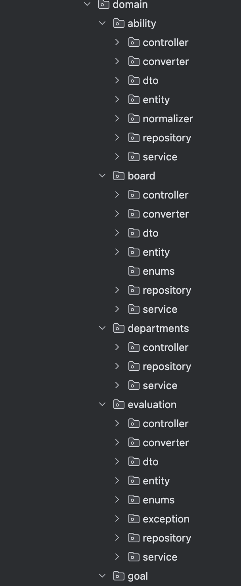
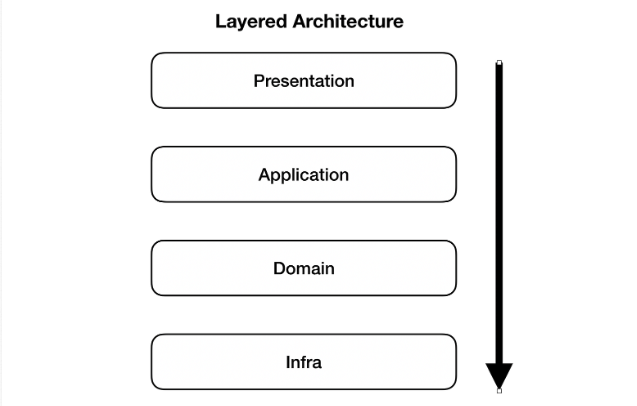
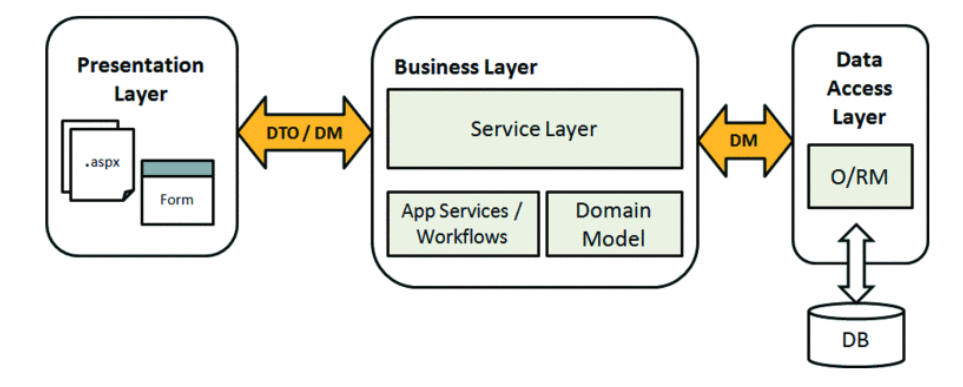

### 아키텍처 구조란?

**소프트웨어 아키텍처(Software Architecture)** : 시스템의 전체적인 구조와 그 구성 요소들이 서로 어떻게 상호작용하는지 정의한 청사진

- 계층 기반 구조 : 각 층이 자기 바로 아래 층에만 의존하는 방식. 흔히 사용되는 스프링 MVC패턴
    - Presentation (Controller): 사용자 접점 (UI, API 응답)
    - Business (Service): 핵심 로직 (주문 처리, 가입 승인 등)
    - Data Access (Repository): DB와 소통하는 곳

    ```java
    com.example.application/
    ├── controller/           # 프레젠테이션 계층
    │   ├── UserController.java
    │   ├── OrderController.java
    │   └── dto/
    │       ├── UserDto.java
    │       └── OrderDto.java
    ├── service/              # 비즈니스 로직 계층
    │   ├── UserService.java
    │   ├── UserServiceImpl.java
    │   ├── OrderService.java
    │   └── OrderServiceImpl.java
    ├── repository/           # 데이터 액세스 계층
    │   ├── UserRepository.java
    │   └── OrderRepository.java
    ├── model/                # 엔티티 또는 도메인 객체
    │   ├── User.java
    │   └── Order.java
    └── Application.java      # 애플리케이션 진입점
    ```

- 도메인 기반 구조 : 비즈니스의 핵심 기능(주문, 회원, 결제, 게시판)을 중심으로 폴더를 나누는 방식
    - 응집도가 향상되고 협업에 용이하다

    ```java
    com.example.application/
    ├── user/
    │   ├── controller/
    │   ├── service/
    │   └── repository/
    ├── order/
    │   ├── controller/
    │   ├── service/
    │   └── repository/
    └── Application.java
    ```

- 마이크로서비스 아키텍처 (MSA) : 커다란 서비스 하나를 여러 개의 작은 서비스로 쪼개는 방식
    - 장점: 서비스 하나가 고장 나도 전체가 멈추지 않고, 서비스별로 다른 언어나 DB를 쓸 수 있어 확장에 유리
    - 단점: 서비스 간 통신이 복잡하고 관리하기 어려움

<hr>

### Swagger란?
**Swagger :** 내가 만든 API가 어떻게 생겼고 어떻게 사용하는지 보여주는 메뉴판

- 백엔드 개발자가 API를 만들고나면 프런트 팀원들에게 공유해야하기 때문에 필수적으로 필요

- 시각화된 API 문서 (Swagger UI)
    - 단순히 글자만 있는 게 아니라 어떤 API(GET, POST 등)가 있는지 한눈에 보여준다
- 'Try it out' (실시간 테스트)
    - 포스트맨(Postman) 같은 별도의 도구 없이도 웹 페이지상에서 바로 값을 넣어서 API를 호출해볼 수 있다
- OpenAPI Specification (OAS) 준수
    - Swagger는 **OpenAPI**라는 표준 규격을 따른다.

<hr>

### 도메인형 아키텍처란?
**도메인형 아키텍처** : 도메인을 기준으로 패키지를 나눈 구조

도메인 : 게시글, 댓글, 회원, 정산, 결제 등 소프트웨어에 대한 요구사항 혹은 문제 영역

- **장점**
    - 도메인별 응집도가 높아진다.
        - 도메인의 흐름을 파악하기 쉽다.
        - 도메인과 관련된 스펙 & 기능이 변경되었을 때, 변경 범위가 적다.
    - 유스케이스별로 세분화해서 표현이 가능하다.
- **단점**
    - 애플리케이션의 전반적인 흐름을 한눈에 파악하기가 어렵다.
        - 흐름을 파악하기 위해 여러 패키지를 왔다갔다 해야할 가능성이 높다.
    - 개발자의 관점에 따라 어느 패키지에 둘지 애매한 클래스들이 존재한다.
        - 자신이 예상하는 패키지와 다를 때, 해당 클래스를 찾기가 어렵다.


<hr>

### DDD vs 도메인형 아키텍처

#### DDD는 비지니스 로직을 보호하기 위한 ‘규칙’이고, 도메인형은 그 규칙을 잘 지키기 위해 코드를 배치하는 ‘공간’

**DDD** : 여러가지 도메인들이 상호작용하며 비지니스 도메인별로 나누어 설계하는 것

- 도메인 : 실세계에서 사건이 발생하는 집합
- 도메인은 사용자가 누구인가, 어떻게 사용하냐에 따라 같은 요소라고 할지라도 계속 바뀔 수 있고 형태가 고정되어 있지 않다

**DDD 구조의 목표** : 각각의 도메인은 서로 철저히 분리되고 높은 응집력과 낮은 결합도로 변경과 확장에 용이한 설계

**DDD의 계층구조**

- 각각의 layer는 하나의 관심사에만 집중
- 위의 계층에서 아래 계층으로 접근이 가능하지만 아래에서 위로는 불가능



1. Presentation Layer (표현 계층) (Controller)
    - 사용자 요청에 대해 해석하고 응답하는 일을 책임지는 계층이다.
    - 사용자에게 UI를 제공하거나 클라이언트에 응답을 다시 보내는 역할을 하는 모든 클래스가 포함된다.
    - Client로부터 request를 받고 response를 return 하는 API 정의
2. Application Layer (응용계층) (Service)
    - 비즈니스 로직을 정의하고 정상적으로 수행될 수 있도록 도메인 계층과 인프라스트럭쳐 계층을 연결해주는 역할을 하는 계층이다
    - 트랜잭션의 단위, DTO 변환, 엔티티 조회/저장, 사용자 인증/인가, 파라미터 검증
3. Domain Layer (도메인 계층) (Model)
    - 비즈니스 규칙, 정보에 대한 실질적인 도메인에 대한 정보를 가지고 있으며 이 모든 것을 책임지는 계층이다.
4. Infrastructure Layer (인프라 계층) (Repository)
    - 외부와의 통신(DB)을 담당하는 계층

**장단점**

- 각 레이어를 loosely coupling 된 형태로 구축하면서, 각각 자신의 관심사에만 집중할 수 있다.
- 핵심 비즈니스 로직을 순수하게 유지함으로써 유지보수와 확장성 측면에서 이득을 얻을 수 있다.
- 각 레이어에 서로 다른 추상화 수준을 가진 상태와 행동을 위치시킴으로써 코드 재사용성을 높일 수 있다.
- 서비스가 커질수록 복잡도가 증가하여 확장성이 떨어진다.
- 레이어로 분리된 관심사 외에 다른 관심사가 생길 경우 패키지 분리 및 코드 배치가 어렵다.

**DDD vs 도메인형 구조**

| **구분** | **DDD 아키텍처 (Domain-Driven Design)** | **도메인형 아키텍처 (Domain-based Packaging)** |
| --- | --- | --- |
| **핵심 질문** | **"비즈니스 규칙을 어떻게 코드로 보호할까?"** | **"관련 있는 코드들을 어떻게 묶어서 배치할까?"** |
| **주요 관점** | **계층(Layer)** 간의 역할 분리 및 도메인 고립 | **기능(Domain)** 단위의 패키지 분리 |
| **물리적 형태** | 4계층 구조 (Interfaces, App, Domain, Infra) | `member`, `mission`, `review` 식의 폴더 구조 |
| **비유** | **조리법(Recipe):** 재료 손질과 요리 과정을 엄격히 나눔 | **냉장고 정리:** 고기 칸, 야채 칸으로 칸을 나눔 |
- DDD : DB가 바뀌어도 도메인은 변경되지 않는다는 논리적인 설계 원칙 강조
    - 비지니스 로직이 매우 복잡할 때 사용
- 도메인형 : member, mission 같은 기능 단위로 폴더 만듬
    - 폴더 안에서 컨트롤러, DTO, 서비스 모두 해결 가능
    - 서비스가 커저셔 특정 도메인을 유지보수할 때 유리

<hr>

### 왜 DTO를 사용하는가?

DTO(Data Transfer Object) : 데이터 전송 객체, 즉 계층 간 데이터 전송을 위해 도메인 모델 대신 사용되는 객체. 계층이란 Presentation (View, Controller), Business (Service), Persistence (DAO, Repository) 



**사용이유**

- 관심사의 분리
    - 엔티티 : 비니지스의 핵심 로직을 담는 개체. DB 테이블 구조와 직결되어 있어 함부로 바뀌면 시스템 전체가 흔들린다 (Business 계층)
    - DTO : 데이터를 나르는 배달부 역할. UI에 따라 데이터 모양을 자유자재로 바꾼다 (Presentation 계층)
- 보안과 데이터 보호
    - 민감 정보 노출 방지 : 엔티티에는 비밀번호, 주민번호 등 보안이 중요한 필드가 포함될 수 있다
    - 필요한 정보만 전달 : DTO 사용하면 요구하는 데이터만 선별해서 보낼 수 있다
- 호출 비용 최소화
    - 일괄 처리

```java
package navik.domain.board.dto.board;

import lombok.AllArgsConstructor;
import lombok.Builder;
import lombok.Getter;
import lombok.NoArgsConstructor;

@Getter
@Builder
@AllArgsConstructor
@NoArgsConstructor
public class BoardCreateDTO {
private String articleTitle;
private String articleContent;
}
```

<hr>

### 컨버터는 왜 사용하는가?

**Converter** : 엔티티와 DTO를 잇는 중간 다리 역할

- 서비스 레이어의 복잡함을 덜어주고 데이터 변환 규칙을 한 곳에서 안전하게 관리

**사용이유**

- 서비스 로직의 순수성 유지
    - Converter를 사용하지 않으면 서비스 레이어에 단순한 코드들이 가득찬다
        - 비지니스 로직에 집중하지 못하게 된다
        - 서비스는 converter에게 데이터를 가져와서 변환해라는 명령만 하면 된다
- 단일 책임원칙
    - Entity와 DTO를 통해 관심사 분리를 진행하고 Converter를 통해 두 객체 사이의 변환 규칙을 정한다.
- 재사용성과 테스트 용이성
    - 여러 서비스에서 공통으로 사용할 수 있다
    - “변환”에 대한 기능만 있기 때문에 유닛 테스트를 하기 쉽다

```java
public class BoardConverter {

	public static BoardResponseDTO.BoardDTO toBoardDTO(
		Board board,
		Integer commentCount,
		Boolean isLiked
	) {
		return BoardResponseDTO.BoardDTO.builder()
			.boardId(board.getId())
			.userId(board.getUser().getId())
			.jobName(board.getUser().getJob().getName())
			.profileImageUrl(board.getUser().getProfileImageUrl())
			.level(board.getUser().getLevel())
			.nickname(board.getUser().getNickname())
			.articleTitle(board.getArticleTitle())
			.articleContent(board.getArticleContent())
			.isEntryLevel(board.getUser().getIsEntryLevel())
			.likeCount(board.getArticleLikes())
			.commentCount(commentCount)
			.viewCount(board.getArticleViews())
			.isLiked(isLiked)
			.createdAt(board.getCreatedAt())
			.build();
	}
}
```
