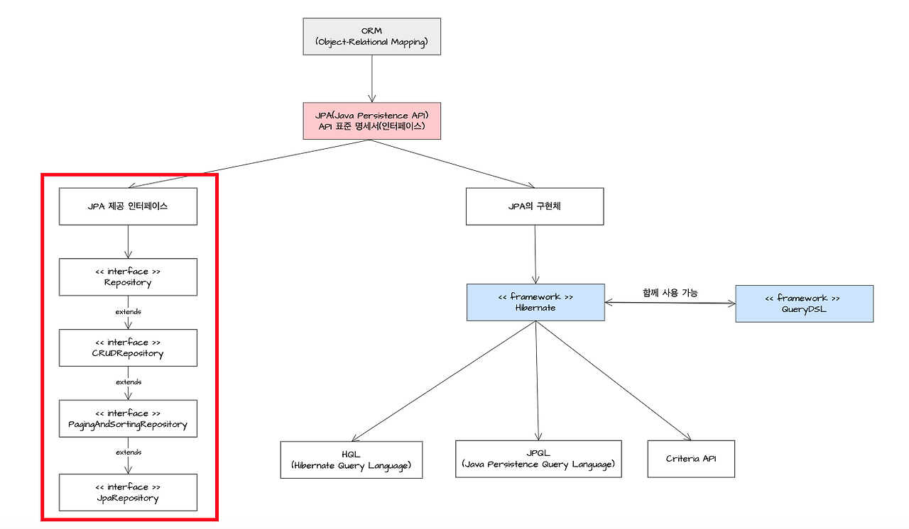
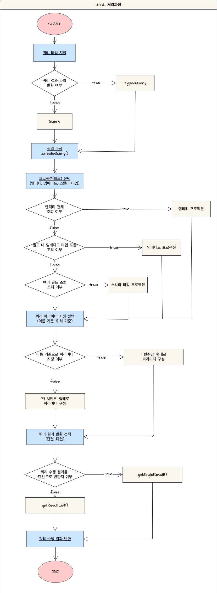

### JPA란?

  **JPA :** 데이터베이스를 쉽게 다루기 위한 ‘데이터 액세스 기술’로 ORM 기법을 사용하여 자바 애플리케이션에서 사용하는 객체와 관계형 데이터베이스 사이의 매핑을 관리하는 ORM 기술에 대한 API 표준 인터페이스

  → 표준화된 API를 제공함으로써, 다양한 ORM 프레임워크와의 호환성을 보장해 개발자가 특정 ORM 프레임워크에 종속되지 않고 필요에 따라 다른 프레임워크로 쉽게 전환 가능하다.

  ORM : 객체와 관계형 데이터베이스의 데이터를 매핑하여 ‘객체 지향적인 코드’를 작성 가능하게 하는 기술을 의미 ⇒ ORM을 사용해서 개발자는 SQL 쿼리를 직접 작성하는 대신 자바 객체를 사용하여 데이터베이스의 레코드를 쉽게 생성, 조회, 수정, 삭제할 수 있다.

  

  - Repository : 가장 기본이 되는 마커 인터페이스
  - CrudRepository : save(), findById(), delete() 같은 기본적인 CRUD 기능을 제공
  - PagingAndSortingRepository : 페이징과 정렬 기능을 추가로 제공
  - JpaRepository : JPA에 특화된 기능까지 모두 합친 인터페이스

<hr>

### N+1 문제란?

  **N+1 문제 :** 하나의 엔티티를 조회할 때 해당 엔티티와 연관된 엔티티에 접근할 때 지연 로딩 전략에 따라서 추가적인 쿼리가 N번(처음 조회된 엔티티의 개수)만큼 나가는 것

  [지연 로딩]

  지연 로딩 전략은 특정 엔티티를 조회할 때 연관된 엔티티를 즉시 조회하지 않고 필요할 때 조회하는 전략. 지연 로딩을 사용하지 않는다면 특정 엔티티와 연관된 모든 정보들이 조회되면서 불필요한 비용이 추가적으로 발생하게 된다.

  [예시]

  축구 팀이 3개가 있고 각 팀마다 회원이 2명씩 있다고 한다.
  처음에 팀을 조회하는 쿼리가 날아가고(3개 팀 반환) 이후에 3개의 팀에 대해서 각각 회원에 대한 쿼리 날아간다. (팀 전체 조회) 1 + (팀의 개수) 3 번의 쿼리가 나가고, 첫번째 조회 쿼리의 결과 개수를 N이라고 하면 1 + N개의 쿼리가 나간다.

  [예시에 대한 문제]

  N+1 문제가 발생하면 처음의 조회 결과만큼의(팀의 개수) 추가 쿼리가 발생하게 된다. 위의 예시에서는 팀과 연관된 클래스가 회원밖에 없었기 때문에 N번밖에 발생하지 않았지만(팀의 구장, 팀이 축구화 등) 연관된 엔티티가 많을수록 N * M번의 쿼리가 발생할 수 있고 이렇게 쿼리가 많아지면 DB와의 통신이 발생하기 때문에 성능에 악영향을 줄 수밖에 없다.

  [해결점]

  1. Fetch Join 사용 : Team과 Member를 조인해서 가져오기 때문에 추가 조회 쿼리 발생하지 않는다)
  2. @EntityGraph : 가져올 엔티티를 지정한 EntityGraph 생성하고, 해당 EntityGraph를 조회하는 메소드에 파라미터로 넘겨서 조회할 때 함께 가져온다.

  ```
        EntityGraph<Team> entityGraph = em.createEntityGraph(Team.class);
        entityGraph.addSubgraph("members");
        
        @EntityGraph(attributePaths = "members")
  ```

  3. @BatchSize : 지정한 size만큼 IN 쿼리를 사용해서 뭉텅이(Batch)로 가져오는 방식
     - batch fetching : 조회되는 엔티티 위에 @BatchSize를 추가한 뒤 Member 엔티티가 조회될 때 IN절을 통해 한번에 조회 가능하다. (지정된 크기만큼 쪼개서 IN절)
     - subslect fetching : Member 엔티티 위에 @Fetch를 사용하면 엔티티가 조회될 때 IN절과 서브 쿼리를 사용하여 한번에 조회 가능. (이전 쿼리를 통째로 서브쿼리로)

        ```
            @BatchSize(size = 100) 
            @OneToMany(mappedBy = "team")
            private List<Member> members = new ArrayList<>();
        
           
            @Fetch(FetchMode.SUBSELECT)
            @OneToMany(mappedBy = "team")
            private List<Member> members2 = new ArrayList<>();
        ```
<hr>

### 지연로딩과 즉시로딩의 차이는?

  ORM(객체 관계 매핑) 프레임워크에서 연관 관계에 있는 엔티티를 데이터베이스에서 조회하는 방식 결정

  **즉시 로딩(Eager Loading)**

  - 특정 엔티티를 조회할 때 연관관계에 있는 다른 엔티티들을 모두 한 번에 같이 로딩
    - @ManyToOne, @OneToOne과 같은 관계에 대해 디폴트로 적용되는 방식
    - 한번에 데이터를 가져오기 때문에, 복잡한 상황에서는 N+1 쿼리 폭탄 터트린다
    - fetch = FetchType.EAGER

      ```sql
      SELECT
          m.member_id,
          m.name AS member_name,
          t.team_id,
          t.name AS team_name
      FROM
          MEMBER m
      LEFT OUTER JOIN
          TEAM t ON m.team_id = t.team_id
      WHERE
          m.member_id = 1;
        
      -- 쿼리 1회 실행
      ```


  **지연 로딩(Lazy Loading)**
    
  - 특정 엔티티를 조회할 때 연관 관계에 있는 엔티티는 실제로 사용될 때까지 로딩을 미루는 방식
  - 메인 엔티티만 먼저 로딩하고 연관된 엔티티는 프록시 객체로 대체. 연관된 엔티티의 실제 데이터에 접근하는 순간에 비로소 데이터베이스에 쿼리를 보내 로딩한다.
  - 대부분 모든 연관관계를 반드시 지연로딩으로 설정
  - fetch = fetchType.LAZY
        
    ```sql
    SELECT
        member_id,
        name,
        team_id
    FROM
        MEMBER
    WHERE
        member_id = 1;
        
    -- 쿼리 1회 실행
        
    시간이 흘러 실제 연관 데이터인 Team을 사용해야하는 순간
        
    -- 데이터베이스에 추가 쿼리가 날아갑니다. (초기화)
    SELECT
        t.team_id,
        t.name AS team_name
    FROM
        TEAM t
    WHERE
        t.team_id = ?; -- 1번 쿼리에서 얻어둔 m.team_id 값
    ```

<hr>

### JPQL란?

  **JPQL** : JPA에서 사용하는 객체 지향 쿼리 언어 (엔티티 객체 조회)

  - 테이블을 대상으로 쿼리하지 않고 엔티티 객체를 대상으로 쿼리

  [JPQL 특징]

  - 기본적인 연산 지원 : SELECT, UPDATE, DELETE 등의 기본적인 연산 지원하고 함수 연산자 키워드 등 다양한 기능 제공
  - 객체지향 쿼리 언어 : 자바의 특성 최대한 활용할 수 있으며 쿼리 결과를 객체 또는 객체의 컬렉션으로 직접 반환 받을 수 있다.
  - 타입 안정성 제공 : 컴파일 시점에 쿼리의 문법 오류를 검사할 수 있다.

  [JPQL 한계]

  1. 동적 쿼리 사용의 어려움
  2. 문자열 구성에 대한 오류 발생 : 쿼리 문자열 내부에 오타나 문법 오류가 있을 경우 이를 컴파일 시점에 체크할 수 없다. 이로 인해 실행시점에 오류 발생 가능
  3. SQL의 모든 기능 사용 불가능
  4. 복잡한 JOIN 문제

  [JPQL 처리 방식]

  - 리턴 타입 ‘쿼리 타입’을 지정 : TypedQuery, Query
     - TypedQuery : 반환되는 ‘타입이 명확할 때’ 사용하는 클래스. 반환 타입을 미리 지정하기 때문에 컴파일 시점에 오류를 잡을 수 있어서 안정적

         ```sql
         @PersistenceContext
         private EntityManager em;
                
         // 쿼리를 수행합니다.
         TypedQuery<UserEntity> typedQuery = em.createQuery("select u from UserEntity u where u.id = :id", UserEntity.class);
            
         // 리스트 형태로 결과값을 반환 받습니다.
         List<UserEntity> resultList = typedQuery.getResultList();
         ```

     - Query : 반환되는 ‘타입이 명확하지 않을 때’ 사용하는 클래스. 다양한 타입의 결과로 반환받을 수 있지만 타입 체크가 런타임 시점에 수행되어 안정성 떨어질 수 있다

         ```sql
         @PersistenceContext
         private EntityManager em;
                
                
         Query query = em.createQuery("select u from UserEntity u where u.id = :id");
            
         // 단일한 결과를 반환 받습니다 : NoResultException, NonUniqueResultException 오류가 발생 할 수 있음.
         Object result = query.getSingleResult();
            
         // 리스트 형태로 결과를 반환 받습니다.
         List<UserEntity> resultList = query.getResultList();
         ```

  - 쿼리 구성 : createQuery
      - 이름 기준 파라미터 바운딩 : 쿼리 내에서 ‘:변수명’ 형태로 선언한 후에 setParameter 메서드를 사용하여 값들을 사용하여 값을 설정하는 방식

          ```sql
          @PersistenceContext
          private EntityManager em;
            
          TypedQuery<UserEntity> typedQuery = em
                        .createQuery("select u from UserEntity u where u.id = :id and u.userNm = :userNm", UserEntity.class)
                        .setParameter("id", 1234)
                        .setParameter("userNm", "admin");
          ```

      - 위치 기준 파리미터 바운딩 : 쿼리 내에 파라미터를 ‘?위치번호’ 형태로 선언한 후 setParameter 메서드를 사용하여 값을 설정(권장하지 않음)

          ```sql
          @PersistenceContext
          private EntityManager em;
                
                
          TypedQuery<UserEntity> typedQuery2 = em
                      .createQuery("select u from UserEntity u where u.id = ?1 and u.userNm = ?2", UserEntity.class)
                      .setParameter(1, 1234)
                      .setParameter(2, "admin");
          ```

  - 쿼리 프로젝션을 설정 : 엔티티, 임베디드 타입, 스칼라 타입 프로젝션

    **쿼리 결과로 ‘특정 필드’만 선택하여 가져오는 것**

    1. 엔티티 프로젝션 : 엔티티를 직접 선택하여 조회하는 방식. 엔티티에 있는 모든 필드가 조회됨

       ```java
       @PersistenceContext
       private EntityManager em;
                
                
       // [CASE1] 엔티티(테이블)의 모든 필드(컬럼)을 조회합니다.
       TypedQuery<UserEntity> typedQuery = em
               .createQuery("select u from UserEntity u where u.id = :id and u.userNm = :userNm", UserEntity.class)
               .setParameter("id", 1234)
               .setParameter("userNm", "admin");
       ```

    2. 임베디드 타입 프로젝션 : 엔티티의 특정 부분을 직접 조회하는 방식. 여러 속성을 한번에 묶어서 조회할 수 있음(엔티티내에 필드가 임베디드 타입인 경우에 사용)

      ```sql
      @Entity
      public class Order {
          @Id
          @GeneratedValue
          private Long id;
            
          @Embedded
          private Address address;
      }
            
      @Embeddable
      public class Address {
          private String street;
          private String city;
          private String state;
          private String zipCode;
      }
            
      @PersistenceContext
      private EntityManager em;
                
                
      List<Address> resultList = em
              .createQuery("select m.address from Order m", Address.class)
              .getResultList();
      ```

    3. 스칼라 타입 프로젝션 : 엔티티 내의 특정 필드들을 선택하여 조회하는 방식

      ```java
      TypedQuery<UserEntity> typedQuery = em
                  // UserEntity 내에서 userId, userNm의 특정 엔티티 필드만 가져옵니다.
                  .createQuery("select u.userId, u.userNm from UserEntity u where u.id = :id and u.userNm = :userNm", UserEntity.class)
                  .setParameter("id", 1234)
                  .setParameter("userNm", "admin");
      ```

  - 쿼리 파라미터 지정 : 이름, 위치 기준 (쿼리 구성에서 설명)
  - 쿼리 결과 조회 방식을 선택 : getSingleResult(), getResultList()
    - getSingleResult() : 쿼리의 결과로 ‘단일 엔티티 객체’를 반환
        - 쿼리 결과가 없거나 결과가 2개 이상인 경우 예외 발생

        ```java
        UserEntity userEntity = em
                .createQuery("select u from UserEntity u where u.id = :id and u.userNm = :userNm", UserEntity.class)
                .setParameter("id", 1234)
                .setParameter("userNm", "admin")
                .getSingleResult();
        ```


   - getResultList() : 쿼리의 결과를 ‘List 형태의 객체’로 반화
     - 쿼리의 결과가 없는 경우 빈 리스트 반환
            
            ```java
            List<UserEntity> userEntityList = em
                    .createQuery("select u from UserEntity u where u.id = :id and u.userNm = :userNm", UserEntity.class)
                    .setParameter("id", 1234)
                    .setParameter("userNm", "admin")
                    .getResultList();
            ```
    
   

<hr>

### Fetch Join란?
  - JPA에서 연관된 엔티티나 컬렉션을 조회할 때 처음부터 함께 로딩하는 방식으로 성능으로 최적화 → A엔티티를 조회할 때 A와 관련된 B엔티티도 SQL 쿼리로 같이 가져와달라고 JPA에게 요청
    - 연관관계의 엔티티나 컬렉션을 프록시가 아닌 진짜 데이터를 한번에 같이 조회하는 기능
    - 지연로딩 전략으로 인해 발생하는 N+1 쿼리 문제를 해결하기 위해 사용

  [Fetch Join 사용 시 주의]

   - 별칭 사용 불가
   - 컬렉션 Fetch Join 시 데이터 중복 : 일대다 같은 컬렉션은 Fetch Join하면, DB에서 데이터 행이 중복되어 조회될 수 있음
   - 두 개 이상의 컬렉션 Fetch Join 불가
   - 페이징 제한

   [N+1 문제] : N개의 엔티티를 조회하기 위해 1번의 SQL 쿼리 실행 + 조회된 N개의 각 엔티티에 연관된 엔티티 접근(N번의 추가 쿼리 발생) ⇒ 총 1 + N번의 쿼리 발생

   [Fetch Join을 통한 N+1 문제해결]

   - 연관된 엔티티를 즉시로딩처럼 동작하게 만들면서 N+1 문제가 발생하지 않도록 처음부터 하나의 SQL 쿼리로 모든 데이터를 로드한다.
   - Member → Team 으로 @ManyToOne관계일때
   - 일반 조인 : select m from Member m join m.team t → Member와 Team을 조인하지만 실제 영속성 컨텍스트에 로딩되는 것은 Member 만이며 Team은 여전히 지연로딩일 수 있다

       ```sql
        select
                distinct team0_.id as id1_1_,
                team0_.name as name2_1_
           from team team0_ 
           inner join
               member members1_
                   on team0_.id=members1_.team_id
       ```

   - Fetch Join : select m from Member m join fetch [m.team](http://m.team) t → Member를 조회하면서 연관된 Team 엔티티도 프록시가 아닌 실제 엔티티 객체로 한 번의 쿼리로 로드하면서 영속성 컨텍스트에 저장한다

       ```sql
       Hibernate:
           select
                distinct team0_.id as id1_1_,
                members1_.id as id1_0_1_,
                team0_.name as name2_1_,
                members1_.age as age2_0_1,
                members1_.name as name3_0_1_,
                members1_.team_id as team_id4_0_1_,
                members1_.team_id as team_id4_0_1_,
                members1_.id as id1_0_1_
           from team team0_ 
           inner join
               member members1_
                   on team0_.id=members1_.team_id
       ```

<hr>

### @EntityGraph란?

  **EntityGraph**

  - JPA에서 연관된 엔티티를 함께 조회할 때 어떤 연관 엔티티를 fetch(즉시) 로딩할지를 지정할 수 있는 기능 → JPQL의 Fetch Join을 직접 쓰지 않고도 어떤 연관관계를 함게 가져올지 선언적으로 설정할 수 있는 방법

  [필요이유]

  - LAZY : N + 1 문제 발생 가능
  - EAGER : 불필요한 조인이 많아짐

    ⇒ EntityGraph를 사용해서 평소엔 LAZY 유지하고, 특징 조회 시점에만 특정 연관 엔티티를 함께 즉시 로딩하도록 제어가능


   [EntityGraph 정의 방식]
        
   1. 즉석 지정 방식(inline)
   - Repository 메서드 위에 바로 @EntityGraph(attributePaths = {..}) 작성
            
   ```
   @EntityGraph(attributePaths = {"orders"})
   @Query("SELECT c FROM Customer c")
   List<Customer> findAllWithOrders();
            
   // 조회시 member도 함께 한 번에 가져옴
   ```
            
        
  2. 이름 기반 방식(@NamedEntityGraph)
   - 엔티티 클래스 안에 미리 그래프를 정의하고 Repository에서 사용함
            
   ```
            @Entity
            @NamedEntityGraph(
                name = "Customer.withOrders",
                attributeNodes = @NamedAttributeNode("orders")
            )
            public class Customer {
                @Id @GeneratedValue
                private Long id;
                private String name;
            
                @OneToMany(mappedBy = "customer")
                private List<Order> orders;
            }
            
            // 이후 레포에서 사용
            @EntityGraph(value = "Customer.withOrders", type = EntityGraph.EntityGraphType.LOAD)
            @Query("SELECT c FROM Customer c")
            List<Customer> findAllWithOrders();
            
   ```

   [@EntityGraph vs Fetch Join]
        
  | 구분 | @EntityGraph | JPQL Fetch Join |
  | --- | --- | --- |
  | 문법 | 애노테이션 기반 | JPQL 직접 작성 |
  | 재사용성 | 엔티티 그래프 이름으로 재사용 가능 | JPQL마다 새로 작성 |
  | 동적 쿼리 | 불가능 (정적) | 가능 |
  | fetch control | 선언적으로 제어 | 쿼리 내에서 제어 |
  | 편의성 | ✅ 매우 간단 | ❌ 쿼리문 직접 작성 필요 |

<hr>

### commit과 flush 차이점은?

  **JPA에서 엔티티 변경 → DB 반영 과정**

  1. 엔티티 변경(persist, merge, remove 등)
  2. 변경 내용이 1차 캐시(영속성 컨텍스트)에 저장됨
  3. flush() → SQL이 실제로 DB로 전송(트랙잭션 안 끝남)
  4. commit() → 트랜잭션이 종료되고 변경 내용이 DB에 확정됨

  **flush() : DB에 쿼리 보내기!**

  - 영속성 컨텍스트이 변경 내용을 DB에 동기화하는 단계
    - SQL을 DB에 보내지만 commit은 하지 않는다
    - 트랜잭션은 여전히 활성 상태

  → 지금까지의 변경 내용을 DB에 반영하지만 트랙잭션은 끝내지마

  - JPA는 자동으로 flush 실행
    - 트랜잭션 커밋 직전
    - JPQL/Criteria 쿼리 실행 직전 (DB와 영속성 컨텍스트의 상태 맞추기위해)
    - 명시적으로 em.flush() 호출했을 때

    ```
    em.persist(member1);
    em.persist(member2);
        
    // 아직 DB에는 반영되지 않음
    em.flush(); // SQL 전송, 그러나 commit은 안 함
        
    System.out.println("flush 완료");
        
    // 트랙잭션이 rollback되면 데이터는 사라짐
     ```


   **Commit() : 보낸 쿼리를 확정시키기!**
    
   - 트랜잭션을 종료하며 DB에 반영된 변경 내용을 영구히 확정하는 단계
   - commit() = flush() + 트랜잭션 확정
   - 이후 rollback(트랜잭션 취소할 때 사용) 불가
   - DB의 실제 데이터가 바뀌는 시점
    
    ```
    em.persist(member);
    tx.commit(); // 내부적으로 flush() → commit 순서로 실행됨
    
    // 자동적으로 flush() 실행 -> SQL 전송 -> DB transaction commit -> 변경 확정
    ```
    
  [공통점]
    
  1. DB와의 동기화 : 둘 다 영속성 컨텍스트의 변경 내용을 DB에 반영
  2. SQL 실행 : 둘 다 INSERT/UPDATE/DELETE SQL을 DB에 실제로 보냄
  3. flush 포함 : commit 시 flush 자동 포함
    
  [차이점]
    
  | 구분 | flush | commit |
  | --- | --- | --- |
  | **의미** | 영속성 컨텍스트 → DB로 **동기화** | 트랜잭션을 **종료 및 확정** |
  | **트랜잭션 상태** | 유지됨 | 종료됨 |
  | **롤백 가능 여부** | 가능 (아직 확정 전) | 불가능 (확정 후) |
  | **SQL 전송 여부** | 전송함 | 전송 + 확정함 |
  | **자동 실행 시점** | JPQL 실행 전, commit 직전 등 | 트랜잭션 끝날 때 |
  | **DB 반영의 영속성** | 임시적 (rollback 시 취소) | 영구적 (rollback 불가) |