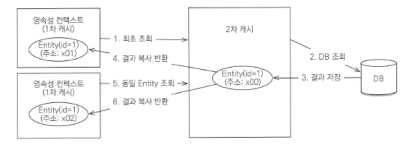

### Page와 Slice

  Spring Data JPA를 사용하게 되면서 PageRequest 객체가 자동으로 limit, offset으로 페이징하던 이전 쿼리를 자동으로 생성해주기 때문에 동적 페이징처리가 쉬워졌다.

  **PageRequest 객체를 통해 페이징을 할 때 반환형으로는 Page와 Slice가 있다**

  **Page**

  - 조회된 데이터 리스트뿐만 아니라 전체 데이터 개수와 전체 페이지 수를 함께 반환한다
  - 데이터를 가져오는 쿼리 외에 전체 개수를 확인하는 count 쿼리를 한번 더 실행한다
  - 게시판 하단에 [1] 처럼 페이지 번호 UI를 만들 때 필수

  **Slice**

  - 전체 개수를 세지 않고 오직 다음 페이지가 존재하는지 여부만 확인하다
  - 요청 받은 사이즈보다 딱 하나 더 많은 데이터를 조회하여 다음 데이터의 존재 여부를 판단한다
  - 무한 스크롤이나 모바일의 '더보기' 버튼처럼 전체 개수가 당장 중요하지 않은 UI에 최적화

  | 비교 항목 | Page | Slice |
      | --- | --- | --- |
  | 반환 정보 | 데이터 + 전체 개수 + 전체 페이지 수 | 데이터 + 다음 페이지 존재 여부 |
  | 추가 쿼리 | `count` 쿼리 발생 (데이터 많을수록 부하 증가) | 추가 쿼리 없음 (`size + 1` 조회로 해결) |
  | UI 적합성 | 고전적인 페이지 번호 방식 | 무한 스크롤, 모바일 앱 |
  | 성능 | 상대적으로 느림 (Count 쿼리 부담) | 상대적으로 빠름 |

<hr>

### Java stream API

  **Stream** : 데이터의 흐름을 파이프라인처럼 연결해서 깔끔하게 처리하는 기술

  - 코드가 선언형으로 변경됨
    - 기존에는 명령형으로 ‘인덱스를 0부터 끝까지 돌리면서 만약 데이터가 짝수이면 새로운 리스트에 값을 추가해’
    - 스트림은 선언형으로 데이터 줘 → 짝수만 걸러 → 리스트로 모아


  **Stream의 동작**
    
  **1. 생성 (Source)**
    
  - 스트림을 사용하기 위해 컬렉션이나 배열을 스트림 객체로 변환하는 첫 단계.
    
  **2. 중간 연산 (Intermediate Operations)**
    
  - 데이터를 입맛에 맞게 가공하는 단계. 중간 연산은 계속해서 체인처럼 여러 개를 연결할 수 있다.
    - `filter(조건)`: 조건에 맞는 데이터만 걸러냅니다. (예: 10점 이상인 것만)
    - `map(변환)`: 데이터를 다른 형태로 바꿉니다. (예: 엔티티 객체를 DTO로 변환)
    - `sorted()`: 데이터를 기준에 맞춰 정렬합니다.
    
  **3. 최종 연산 (Terminal Operations)**
    
  - 가공된 데이터를 최종 결과물로 만들어내는 단계입니다. 이 연산이 호출되어야만 스트림 파이프라인이 닫히고 끝납니다.
    - `collect(Collectors.toList())`: List나 Set 형태로 결과를 모아줍니다.
    - `count()`: 남은 데이터의 총 개수를 셉니다.
    - `forEach(출력)`: 요소를 하나씩 돌면서 출력 등의 액션을 취합니다.
    
    **특징**
    
    - **원본 데이터를 변경하지 않음 (Read-only):** 스트림 파이프라인 안에서 데이터를 거르고 변환해도, 처음에 넣은 원본 `List` 데이터는 절대 변경되지 않아 안전.
    - **일회용 (One-time use):** 최종 연산(`collect`, `count` 등)을 끝내서 한 번 소비한 스트림은 닫혀버림. 재사용할 수 없으며, 다시 작업하려면 `.stream()`을 새로 열어야 힘.
    - **지연 연산 (Lazy Evaluation):** 중간 연산(`filter`, `map`) 코드를 아무리 많이 적어두어도, 맨 마지막에 최종 연산을 호출하기 전까지는 실제로 데이터를 연산하지 않고 계획만 세워둠.

<hr>

### 객체 그래프 탐색

  객체 그래프 탐색 : ORM 기술인 JPA와 같은 환경에서 사용되는 개념, 프로그램의 객체 모델에서 연관 관계로 연결된 객체들을 따라가면서 다른 객체를 조회하는 과정

  [예시]

  ```java
    order.getMember().getAddress().getCity();
   ```

  객체 그래프 : 메모리상에서 객체들이 서로를 참조하면서 만들어지는 네트워크 구조. 객체 하나하나가 그래프의 정점이 되고, 객체 간의 연관관계가 간선이 된다

  [중요한 이유]

  1. 도메인 기반 설계인 DDD에서는 객체들이 연결되어 있으므로 상태/행동을 가져오기 위해 탐색이 필수다.
  2. ORM에서 핵심개념으로 사용된다. Lazy/Eager loading 모두 객체 그래프 탐색 시점을 언제로 할지 결정하는 것이다.
     - Lazy : 접근할 때 쿼리 실행
     - Eager : 처음부터 전부 로딩
  3. 그래프를 순회하며 JSON 변환할 때 양방한 연관관계가 있으면 무한 루프가 발생할 수 있다

  [장점]

  1. 객체 지향적 설계 가능 : SQL/DB 테이블이 아닌 객체의 참조를 통해 데이터를 조회하기 때문에 메모리에 있는 객체를 다루는 것처럼 자연스럽게 프로그래밍 가능
  2. 연관된 객체를 직접 조회 메서드로 접근할 수 있기 때문에 개발이 용이하다
  3. 연관 관계에 대한 로직이 객체 내부에 캡슐화되어 있어 응집도가 높다

  [단점]

  1. N + 1 문제 발생 가능 : JPA에서 Lazy 로딩된 객체를 반복문으로 탐색하면 추가 쿼리 발생
  2. 한 객체에서 너무 깊은 탐색을 진행하면 의존성이 복잡해지고 유지보수가 어려워진다
  3. 지연로딩은 엔티티가 영속성 컨텍스트의 관리 범위 내에 있을 때만 가능하기 때문에 범위를 벗어나서 접근하려 하면 예외 발생할 수 있다

  [올바르게 사용하는 방법]

  1. Aggregate Root 외부로 객체 그래프 노출x
  2. JPA에서는 Fetch Join 사용
  3. JSON 직렬화 할 때 @JsonIgnore, @JsonManagedReference, @JsonBackReference 혹은 DTO 변환 사용

<hr>

### @Valid vs @Validated

  **@Valid : 자바(Java)가 만든 오리지널 기본 검증기**

  - 주로 컨트롤러에서 @RequestBody로 들어오는 DTO 객체 검증
  - 중첩 객체 검증 가능 → DTO 안에 또 다른 DTO가 있을 때 내부 DTO까지 검사하려면 반드시 사용

  **@Validated :  스프링(Spring)이 그걸 가져와서 기능을 더 추가한 확장판 검증기**

  - 클래스 레벨의 단일 변수를 검증할 수 있다(컨트롤러 클래스 위에 붙여주어야 스프링이 파라미터 하나하나를 체크할 수 있음)
  - 그룹을 검증할 수 있음 (같은 DTO 쓸 때 ‘생성할 때’와 ‘수정할 때’ 검증 규칙 다를 수 있음
      - 이때 @Validated를 사용해 그룹을 나눈다

  - 기본적인 DTO 검증 (`@RequestBody`, `@ModelAttribute`) ➔ `@Valid` 사용
  - DTO 안에 있는 DTO(중첩 객체)를 검증할 때 ➔ `@Valid` 사용
  - `@PathVariable`이나 `@RequestParam` 같은 낱개 변수를 검증할 때 ➔ 컨트롤러 클래스 위에 `@Validated` 사용
  - 상황에 따라 (생성/수정) 검증 조건을 다르게 적용하고 싶을 때 ➔ 파라미터에 `@Validated(그룹.class)` 사용

  | **비교 항목** | **@Valid** | **@Validated** |
      | --- | --- | --- |
  | **소속 (출처)** | Java 표준 (`jakarta.validation`) | Spring 프레임워크 (`org.springframework...`) |
  | **적용 위치** | 메서드 파라미터, 필드(DTO 내부) | **클래스 레벨**, 메서드 파라미터 |
  | **그룹(Group) 지정** | ❌ 불가능 | ✅ **가능** (상황별 다른 검증 적용) |
  | **단일 변수 검증**
    (`@PathVariable` 등) | ❌ 불가능 | ✅ **가능** (클래스 레벨에 선언 시) |
  | **중첩 객체 검증** | ✅ **가능** (DTO 안의 DTO 검증) | ❌ 불가능 |

<hr>

### Hibernate 2차 캐시

- 애플리케이션에서 공유하는 캐시를 JPA는 공유 캐시(Shared Cache)라 하는데 일반적으로 2차 캐시 (Second Level Cache, L2 Cache)라 부릅니다. 2차 캐시는 애플리케이션 범위의 캐시입니다. 따라서 애플리케이션을 종료할 때까지 캐시가 유지됩니다. 분산 캐시나 클러스터링 환경의 캐시는 애플리케이션보다 더 오래 유지 될 수도 있습니다. 엔티티 매니저를 통해 데이터를 조회할 때 우선 2차 캐시에서 찾고 없으면 데이터베이스에서 찾습니다. 2차 캐시를 적절히 활용하면 데이터베이스 조회 횟수를 획기적으로 줄일 수 있습니다



하이버네이트를 포함한 대부분의 JPA 구현체들은 애플리케이셔 범위의  캐시를 지원하는데 이것을 2차 캐시라고 합니다.

2차 캐시의 동작 방식은 아래와 같이 동작합니다.

1. 영속성 컨텍스트는 엔티티가 필요하면 2차 캐시를 조회합니다.
2. 2차 캐시에 엔티티가 없으면 데이터베이스를 조회합니다.
3. 결과를 2차 캐시에 보관합니다.
4. 2차 캐시는 자신이 보관하고 있는 엔티티를 복사해서 반환합니다.
5. 2차 캐시에 저장되어 있는 엔티티를 조회하면 복사본을 만들어 반환합니다.
6. 2차 캐시는 데이터베이스 기본 키를 기준으로 캐시하지만 영속성 컨텍스트가 다르면 객체 동일성 (a== b)을 보장하지 않습니다.

- 2차 캐시는 동시성을 극대화하기 위해 캐시 한 객체를 직접 반환하지 않고 복사본을 만들어서 반환합니다.여기서 복사본을 반환하는 이유는 캐시한 객체를 그대로 반환하면 여러 곳에서 같은 객체를 동시에 수정하는 문제가 발생할 수 있습니다.

```
yml 파일에 추가

spring.jpa.properties.hibernate.cache.use_second_level_cache = true
// 2차 캐시 활성화합니다.

spring.jpa.properties.hibernate.cache.region.factory_class
// 2차 캐시를 처리할 클래스를 지정합니다.

spring.jpa.properties.hibernate.generate_statistics = true
// 하이버네이트가 여러 통계정보를 출력하게 해주는데 캐시 적용 여부를 확인할 수 있습니다.


@Entity  // 2차캐시 활성화. true는 기본 값이라 생략가능 @Cacheable(value=true)
@Cacheable
public class Team {
	@Id @GeneratedValue
	private Long id;
	...
}
```


<hr>

### 배치 사이즈

  **배치 사이즈** : 한 번에 가져와서 학습하는 데이터의 묶음 크기

  - 전체 데이터를 한 번에 다 학습하기에는 컴퓨터의 메모리(RAM, VRAM)가 부족하기 때문에, "컴퓨터가 소화할 수 있을 만큼 데이터를 적당히 잘게 쪼개서 먹여주는 한 입 크기”

  **1. 배치 사이즈 = 1 (Stochastic Gradient Descent)**

  - **방식:** 상자를 한 번에 1개씩만 들고 창고로 나릅니다. (총 100번 왕복)
  - **특징:** 몸(컴퓨터 메모리)은 아주 편하지만, 100번이나 왔다 갔다 해야 하니 시간이 오래 걸리고 지칩니다. 데이터 하나하나에 너무 민감하게 반응해서 학습 방향이 요동칠 수 있습니다.

  **2. 배치 사이즈 = 100 (Batch Gradient Descent)**

  - **방식:** 100개의 상자를 수레에 한 번에 다 싣고 옮깁니다. (총 1번 왕복)
  - **특징:** 한 번만 왔다 갔다 하면 되니 전체적인 방향은 아주 정확합니다. 하지만 수레가 버티지 못하고 부서지거나(컴퓨터의 Out Of Memory 에러 발생), 너무 무거워서 움직이기 힘들 수 있습니다.

  **3. 배치 사이즈 = 32 (Mini-Batch Gradient Descent)**

  - **방식:** 상자를 32개씩 수레에 싣고 여러 번 나누어 옮깁니다. (약 3~4번 왕복)
  - **특징:** 몸(메모리)에 무리도 가지 않으면서, 적당히 빠른 속도로 안정적이게 상자를 옮길 수 있습니다. 실무에서는 보통 컴퓨터 구조에 최적화된 **16, 32, 64, 128, 256** 같은 2의 거듭제곱 숫자를 가장 많이 사용합니다.

<hr>

### transform - groupBy

 - **QueryDSL은 조회 결과를 사용자 정의하는 두 가지 방법을 제공한다**
    1. 행 기반 변환을 위한 FactoryExpressions(com.mysema.query.types.Projections 클래스)
    - projections : QueryDSL을 이용해 entity 전체를 가져오는 것이 아닌 조회 대사을 지정해 원하는 값만 조회하는 것
    - 기본값(tuple), Projections.Bean, Projections.fields, .constructor 등
    2. 집계를 위한 ResultTransformer(com.mysema.query.group.GroupBy 클래스)

  **QueryDSL의 transform() : groupBy 결과를 구조적으로 묶어서 DTO나 컬렉션 형태로 반환**

  - 메모리에서 조인된 결과를 그룹화하여 계층적 데이터 구조로 변환하는데 사용
        - 일반적인 fetch()는 단순히 row 단위의 리스트를 반환하지만 transform()은 계층적 데이터를 DTO, Map 형태로 묶어준다.

        ```
        // 엔티티 구조
        @Entity
        public class Team {
            @Id @GeneratedValue
            private Long id;
            private String name;
        
            @OneToMany(mappedBy = "team")
            private List<Member> members = new ArrayList<>();
        }
        
        @Entity
        public class Member {
            @Id @GeneratedValue
            private Long id;
            private String name;
        
            @ManyToOne(fetch = FetchType.LAZY)
            private Team team;
        }
        
        Map<String, List<String>> result = queryFactory
            .from(team)
            .leftJoin(team.members, member)
            .transform(
                groupBy(team.name).as(list(member.name))
            );
            
        // 결과
        
        {
          "TeamA": ["member1", "member2"],
          "TeamB": ["member3"]
        } 
        ```

      [용어 정리]

     - groupBy(기준) : 어떤 필드로 그룹화할지 지정
     - .as(), .list() : 그룹화된 데이터의 결과 형태 지정
     - .transform() : 변환 로직 실행(결과 Map 또는 List 생성)
     - fetch()와 함께 사용하지 않는다
     - 반환형태는 Map<K, V> 또는 List<DTO>

<hr>

### order by null

  ### [SQL]

  Order By : 정렬 기준을 지정하는 절이고 NULL 값이 포함되는 경우에는 DBMS(데이터베이스 관리 시스템)에 따라 다르게 처리

    ```
    SELECT * 
    FROM employee
    ORDER BY salary ASC;
    // 오름차순일 떄는 작은 값 -> 큰 값, 내림차순일 때는 큰 값 -> 작은 값
    ```

  DBMS별 NULL 처리

  | DBMS | ASC일 때 NULL | DESC일 때 NULL |
      | --- | --- | --- |
  | **Oracle** | 맨 마지막 | 맨 처음 |
  | **PostgreSQL** | 맨 마지막 | 맨 처음 |
  | **MySQL** | 맨 처음 | 맨 마지막 |
  | **SQL Server** | 맨 처음 | 맨 마지막 |

  NULL의 정렬 위치 지정(NULLS FIRST / NULLS LAST)

  → 대부분의 SQL은 ORDER BY 뒤에 NULLS FIRST or NULLS LAST 옵션 가능

    ```
    -- salary 오름차순 정렬, NULL은 맨 뒤로
    SELECT *
    FROM employee
    ORDER BY salary ASC NULLS LAST;
    
    -- salary 내림차순 정렬, NULL은 맨 앞으로
    SELECT *
    FROM employee
    ORDER BY salary DESC NULLS FIRST;
    ```

  ✅ 하지만 mysql은 지원하지 않기 때문에 case문이나 is null 사용해야 한다 (명시적인 NULL 순서 지정)

    ```
    // 1. is null 사용, null이면 1 반환, 아니면 0 반환
    // null인 행이 뒤로 정렬
    -- NULL을 맨 뒤로 보내기
    SELECT *
    FROM employee
    ORDER BY (salary IS NULL), salary ASC;
    
    // 2. case when 사용
    
    SELECT *
    FROM employee
    ORDER BY CASE WHEN salary IS NULL THEN 1 ELSE 0 END, salary ASC;
    ```

  ### [QueryDSL]

  QueryDSL에서는 order by() 메서드에 정렬 조건을 넣어서 사용한다

    ```
    List<Member> result = queryFactory
        .selectFrom(member)
        .orderBy(member.age.asc(), member.username.desc())
        .fetch();
    // 여러 조건을 쉼표로 나열 가능하다
    ```

  NULL 처리

  → SQL과 마찬가지로 DBMS마다 정렬 위치가 다르다.

  → QueryDSL은 JPAQueryFactory → JPQL → DB로 변환되므로 DB가 NULL을 어떻게 처리하는지가 그대로 반영된다 ⇒ Oracle에서는 ASC(오름차순)일 때 NULL이 맨 마지막, MySQL에서는 ASC일 때 NULL이 맨 처음

  ✅SQL과 다르게 QueryDSL에서는 NULLS FIRST / LAST 기능 사용 불가.

  따라서 우회 방법을 사용한다

  1. Expressions.cases() 사용 - 권장!!

    ```java
    import static com.querydsl.core.types.dsl.Expressions.*;
    
    List<Member> result = queryFactory
        .selectFrom(member)
        .orderBy(
            // NULL 값을 뒤로 보내기
            new CaseBuilder()
                .when(member.age.isNull()).then(1)
                .otherwise(0)
                .asc(),
            member.age.asc()
        )
        .fetch();
    
    // NULL이면 1, 아니면 0 반환 -> NULL이면 뒤로 밀린다
    
    // 결과 SQL
    ORDER BY (CASE WHEN age IS NULL THEN 1 ELSE 0 END) ASC, age ASC
    
    ```

  2. Expressions.numberTemplate() 활용

    ```java
    import static com.querydsl.core.types.dsl.Expressions.*;
    
    List<Member> result = queryFactory
        .selectFrom(member)
        .orderBy(
            numberTemplate(Integer.class, "CASE WHEN {0} IS NULL THEN 1 ELSE 0 END", member.age).asc(),
            member.age.asc()
        )
        .fetch();
    
    ```

<hr>

### 카테시안 곱

  **카테시안 곱** : 두 집합의 원소들로 만들 수 있는 '모든 짝(조합)'을 다 지어보는 것

  **카테시안 곱을 방지하는 방법**

  - 조인 조건의 개수를 확인

  : 조인하는 테이블이 N개라면 조인 조건은 최소 N-1개가 반드시 존재해야 한다

  - 테이블 2개 조인 → 조건 1개 이상
  - 테이블 3개 조인 → 조건 2개 이상

  - JOIN ~ ON 구문을 사용

  : 표준 구문인 JOIN ~ ON을 사용하면 ON 절을 비워둘 경우 문법 에러가 발생하기 때문에

  실수를 미연에 방지할 수 있다

  **카테시안 곱을 의도적으로 쓰는 경우: CROSS JOIN**

  : 모든 가능한 조합을 만들어야 할 때 의도적으로 CROSS JOIN이라는 명령어를 사용한다

  - 예시: 대용량 데이터 테스트를 위해 샘플 데이터를 인위적으로 불릴 때
  - 예시: 모든 옷 사이즈(S, M, L, XL)와 모든 색상(Red, Blue, Green)의 조합표를 만들 때

<hr>

### MultipleBagFetchException

  **MultipleBagFetchException** : 한 번의 쿼리로 두 개 이상의 `List` 컬렉션을 `JOIN FETCH` 하려고 할 때 하이버네이트가 화를 내며 던지는 에러

  - `MultipleBagFetchException`은 컬렉션 두 개를 무리하게 한 번에 조인하다가 **카테시안 곱으로 인한 메모리 폭발을 막기 위해 하이버네이트가 쳐주는 안전벨트**입니다.

  [예시]

  만약 1번 게시글에 **댓글이 10개, 태그가 5개** 있다면 DB에서는 두 테이블을 조인하면서 **50줄짜리 카테시안 곱(데이터 뻥튀기)** 결과물을 만들어냅니다. 하이버네이트는 이 50줄의 데이터를 메모리로 끌고 와서 "어떤 게 댓글이고 어떤 게 태그지?" 하고 분류해야 하는데, 두 컬렉션 모두 순서가 없는 주머니(`Bag`) 형태라서 **데이터의 중복을 완벽하게 걸러낼 자신이 없기 때문에 아예 에러를 던지며 포기**해버리는 것입니다.

  [해결 방안]

  1. `List` 대신 `Set` 사용하기 (가장 쉬움, 하지만 주의!)
  - 하이버네이트는 `Set` 자료형에 대해서는 다중 패치 조인을 허용합니다. `Set`은 중복을 허용하지 않는다는 특징이 있기 때문에 하이버네이트가 데이터를 걸러낼 수 있기 때문입니다.
  - 자바 코드에서는 에러가 안 나지만, **DB 입장에서는 여전히 엄청난 카테시안 곱 뻥튀기가 발생**해서 쿼리가 날아갑니다. 데이터가 많으면 성능이 심각하게 저하되므로 실무에서는 잘 쓰지 않습니다.
  2. `default_batch_fetch_size` 사용하기
  - **패치 조인(`JOIN FETCH`)은 가장 데이터가 많은 컬렉션 딱 하나에만 사용**하고, 나머지 컬렉션은 지연 로딩(Lazy Loading)으로 두되 배치 사이즈(Batch Size)를 설정하는 방법입니다.

  3. 쿼리를 두 번으로 쪼개기 (Multiple Queries)
  - 하나의 쿼리로 전부 가져오려는 욕심을 버리고, 쿼리를 두 번 날려서 자바 메모리(1차 캐시)에서 합치는 방법입니다.