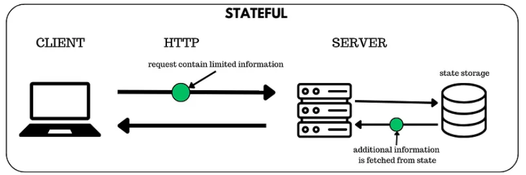
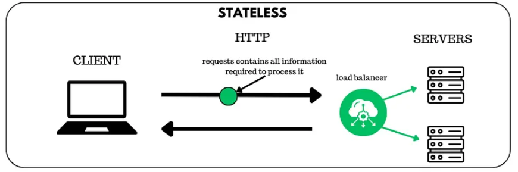

### Spring Security가 무엇인가?

  **Spring Security :** Spring 기반의 애플리케이션의 보안(인증과 권한, 인가 등)을 담당하는 스프링 하위 프레임워크이다. Spring Security는 '인증'과 '인가'에 대한 부분을 **Filter** 흐름에 따라 처리하고 있다.

  - 인증(Authorization)과 인가(Authentication)
    - 인증 : 해당 사용자가 본인이 맞는지를 확인하는 절차
        - 인가 : 인증된 사용자가 요청한 자원에 접근 가능한지를 결정하는 절차
        - Spring Security는 기본적으로 인증 절차를 거친 후에 인가 절차를 진행하게 되며, 인가 과정에서 해당 리소스에 대한 접근 권한이 있는지 확인을 하게 된다.
        - Spring Security에서는 이러한 인증과 인가를 위해 Principal을 아이디로, Credential을 비밀번호로 사용하는 Credential 기반의 인증 방식을 사용한다.
            - Principal (접근 주체) : 보호받는 Resource에 접근하는 대상
            - Credential (비밀번호) : Resource에 접근하는 대상의 비밀번호
    - 사용 이유
        - 편의성 : Spring Security는 보안과 관련해 체계적으로 많은 옵션을 제공해주기 때문에 보안관련 로직을 작성하지 않아도 됨
        - 보안 취약점 개선 : 보안 문제를 서비스 단에서 처리하게 되면 보안 취약점이 이미 발생 후에 대응하게 된다. spring security는 dispatcher servlet에 가기 전에 미리 알 수 있다.
        - 레이어 계층 구조 : Filter 단에서의 보안 체크를 하게 되면 서비스 단에서의 보안 체크와 함께 사용자 요청을 여러 층에서 확인하는 방어적인 방법을 제공할 수 있다.
        - 유지 보수 : 모든 요청이나 특정 요청에 대해 일관성 있는 보안 규칙을 적용할 수 있다.

### 인증(Authentication)vs 인가(Authorization)

  **인증** : 장치 혹은 사용자를 식별하는 행위, 그 사람이 주장하는 신원이 진짜인지 확인

  - 포털 사이트를 보면 어떠한 작업을 하고자 할 때 '로그인이 필요합니다' 문구와 함께 로그인 인증이 요구된다면 이는 인증(Authentication)이 필요한 상황입니다. 서버 입장에서는 현재 요청자가 회원인지 알 수 없습니다.
    - ID와 비밀번호로 로그인
    - 휴대폰 본인 인증
    - Google, Kakao 등
    - 지문, 얼굴 인식
    - OTP 사용
  - 사용되는 기술
      - JWT
          - 인증에 성공하면 서버가 발급하는 토큰
          - 토큰 안에 사용자 정보와 유효 기간이 포함
          - 클라이언트는 이 토큰을 요청 시마다 헤더에 담아 인증 수행
      - OAuth 2.0
          - 제 3자 인증 방식
          - 신뢰된 플랫폼을 통해 로그인
      - SSO
          - 한 번 로그인으로 여러 서비스에 접근 가능
          - 구글 계정으로 gmail, youtube 등 사용

  **인가** : 장치 및 사용자의 접근 권한을 허용/거부하는 행위, 사용자가 어떤 기능이나 데이터에 접근할 권한이 있는지 판단

  - 결국 요청자는 회원가입 및 로그인을 하고 원하는 작업을 하려고 했으나 '권한이 없어 이용할 수 없습니다.'라는 문구가 뜹니다. 이는 인가(Authorization) 즉 접근 권한이 없기 때문에 발생되는 상황입니다.
  - 인증(로그인이 되어있는 상태)이 되었어도 인가(로그인은 되어 있지만 권한은 없는 상태)가 없기 때문에 접근할 수 없는 원리입니다. 서버 입장에서 요청자가 로그인을 했기 때문에 누구인지 특정을 하고 있으나, 권한이 없어 해당 요청을 차단한 것입니다.
      - 게시판 글 읽는 누구나 가능하지만, 삭제는 작성자만 가능
      - 인턴은 자료를 열람만 가능하고, 정직원은 편집도 가능
  - 사용되는 기술
      - RBAC : 사용자에게 역할을 부여하고 , 각 역할에 따라 권한을 부여 (Admin, Editor, User)
      - ABAC : 사용자 속성, 환경, 자원 속성 등에 따라 더 세밀하게 접근 제어
      - Access Token 기반 인가
          - API 요청 시 포함된 Access Token을 검사해 접근 권한 여부 판단
          - JWT 안에 포함된 role, scope 등을 기반으로 처리

  백엔드에서 사용되는 방식

  - **인증**
    - 클라이언트가 보낸 로그인 정보를 검증하여 사용자 신원 확인
    - 인증 성공 시 JWT 등 인증 토큰 발급
    - API 요청 시 토큰 유효성 검사 수행
  - **인가**
      - 토큰에 포함된 역할(role)이나 권한(scope) 정보를 기반으로 요청한 자원 접근 허용/거부 결정
      - 세부 권한 정책에 따라 리소스 접근 권한 검증
      - 예: 특정 API는 관리자만 호출 가능

  |                   | 인증(Authentication)  | 인가(Authorization) |
      |-------------------|---------------------|-------------------|
  | 기능                | 자격증명확인              | 권한허가/거부           |
  | 진행방식              | 비밀번호,생체인식,일회용핀 또는 앱 | 보안 권한 설정에 따라 상이   |
  | 사용자가볼수있는가?        | 예                   | 아니오               |
  | 사용자가 직접 변경할 수 있는가? | 부분적으로가능             | 불가능               |
  | 데이터전송             | ID토큰 사용             | 액세스토큰 사용          |

### Stateful vs Stateless

  **Stateful** : 서버가 클라이언트의 상태를 기억하는 구조

  - 사용자가 한 번 요청을 보내고 나면 서버는 그 사용자의 로그인 상태, 세션, 진행중인 작업 같은 문맥을 서버 내부에 저장해 두고 다음 요청을 처리할 때 활용
  - 금융 서비스, 쇼핑몰 장바구니, 상담/챗봇 서비스, 실시간 게임

  **Stateful 구조의 처리 흐름**

  - 클라이언트 → 서버 요청
    - 클라이언트는 최소한의 정보만 보내고 나머지 상태 정보는 서버가 기억한다고 가정
  - 서버가 상태 저장소에서 사용자 상태 조회
      - 서버는 요청에 담긴 세션 ID 등을 기반으로 state storage에서 이전 상태 불러온다.
  - 서버가 상태 + 요청 내용을 조합해 처리
  - 서버 → 클라이언트 응답

  

  **장단점**

  - 서버가 세션/상태를 저장한다.
  - 클라이언트는 세션 ID만 보내면 서버가 사용자를 식별한다.
  - 흐름이 오래 이어지는 서비스(장바구니, 결제 단계, 게임 진행 등)에 적합하다.
  - 단점은 서버 확장(Scaling)이 어렵다는 점이다. 왜냐하면 특정 사용자 요청은 상태를 가진 같은 서버가 처리해야 하기 때문이다.
      - 세션(Session) 기반 로그인
      - 온라인 게임 서버(플레이어 상태 실시간 저장)
      - 워크플로우가 긴 기업 시스템
      - TCP 기반 WebSocket(연결 자체가 상태를 유지)

  **Stateless** : 서버가 클라이언트의 상태를 전혀 저장하지 않는 구조

  - 서버는 요청마다 ‘처음 보는 사람’ 처럼 처리하며 요청 자체에 필요한 데이터가 모두 담겨 있어야 한다.

  

  **Stateless 구조의 처리 흐름**

  - 클라이언트가 완전한 정보를 담아 요청을 보냄
    - 요청(request)에 처리를 위해 필요한 모든 정보가 포함되어 있다.
            - (예: JWT 토큰, 필요한 파라미터, 사용자 정보 등)
    - load balancer가 여러 서버 중에 하나로 요청을 분배
        - 요청이 특정 서버에 고정되지 않는다.
        - load balancer가 트래픽을 여러 서버로 균등하게 배분한다.
    - 서버는 저장된 상태 없이 요청만으로 처리
        - 서버는 과거 상태나 세션 정보를 보지 않는다.
        - 오직 요청에 담긴 정보만으로 작업을 수행한다.
    - 서버 → 클라이언트 응답
        - 처리 결과를 바로 응답하고, 서버는 클라이언트 상태를 저장하지 않는다.
        - (다음 요청도 완전히 새로운 요청으로 취급됨)

  **장단점**

  - 서버는 이전 요청을 기억하지 않는다.
  - 모든 요청은 독립적(Independent)이고 자급자족(Self-contained)해야 한다.
  - 서버 확장성이 매우 뛰어나다.
  - 장애 복구가 쉽다 -> 어떤 서버가 죽어도 다른 서버가 아무 문제 없이 요청을 처리할 수 있기 때문
      - RESTful API
      - JWT 기반 인증
      - 서버리스(Function as a Service)
      - CDN 기반 API Gateway 구조

  **현대 서비스 흐름**

  Stateless를 기본 구조로 삼되, 필요한 경우 Stateful 요소를 부분적으로 결합한다.

  - 필요한 특정 기능에 한해서만 State를 유지하고, 그 외의 API는 Stateless로 설계하는 하이브리드 전략을 쓴다.
  - Stateless → 확장성, 성능, 단순함
  - Stateful → 긴 흐름 관리, 실시간성, 강한 보안
  - 현대적 구조 → Stateless + 중앙 세션 저장소(Redis) 조합