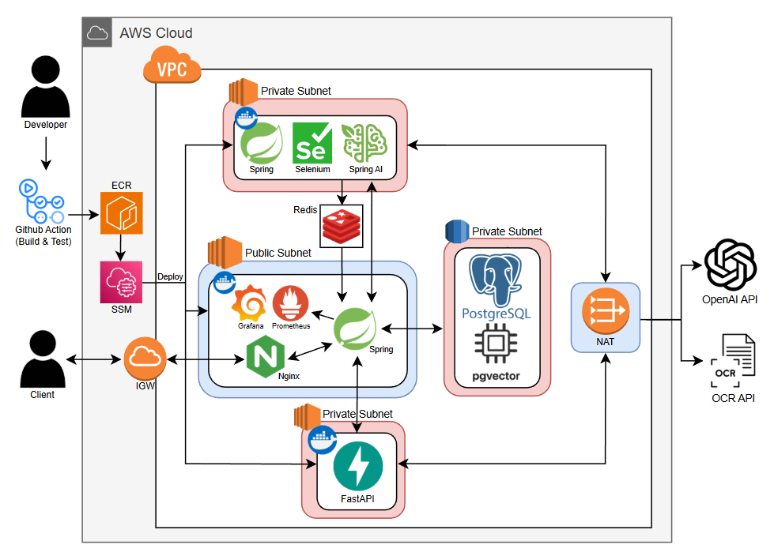
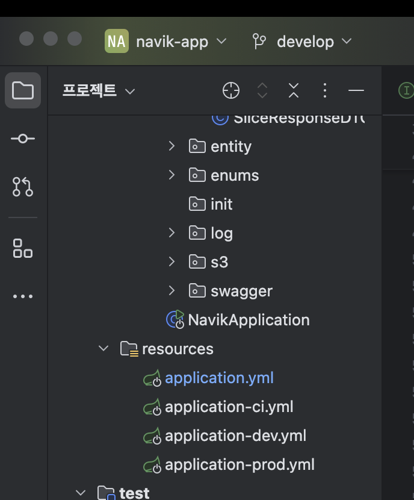
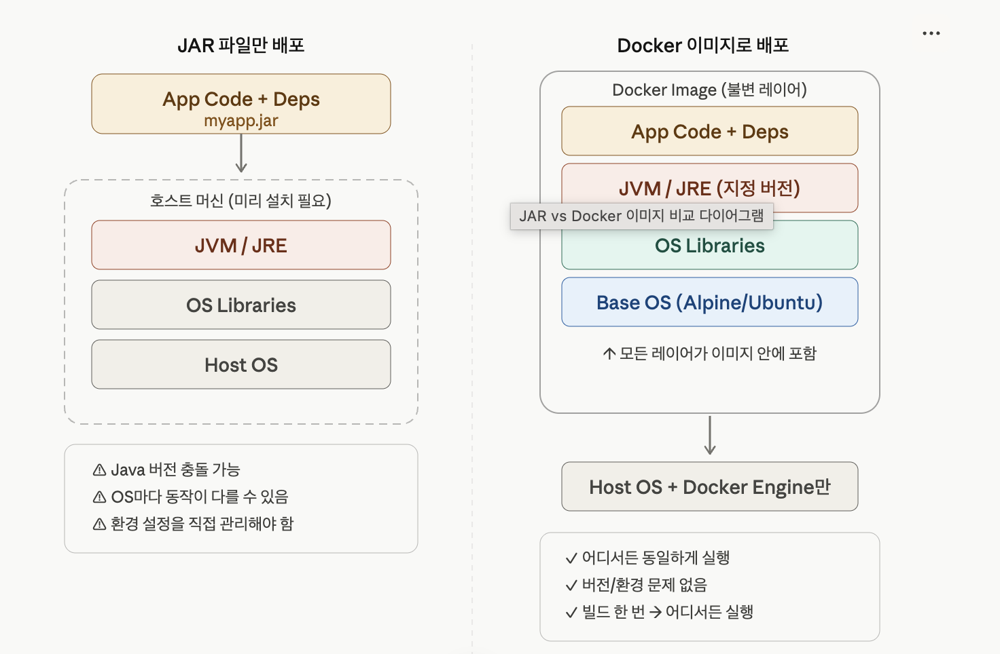

### 클라우드 컴퓨팅이란?

  클라우드 컴퓨팅은 인터넷(클라우드)을 통해 서버, 스토리지, 데이터베이스, 네트워크, 소프트웨어 등 **다양한 IT 자원을 원하는 때에 원하는 만큼 원격으로 빌려 쓰는 서비스**

  **클라우드 컴퓨팅의 핵심 장점**

  - **비용 절감:** 초기에 막대한 장비 구입 비용을 투자할 필요가 없으며, 사용한 만큼만 요금을 지불(Pay-as-you-go)하므로 효율적입니다.
  - **유연성과 확장성:** 사용자나 트래픽이 갑자기 몰리면 클릭 몇 번으로 서버의 성능과 용량을 즉시 늘릴 수 있고(Scale-up/Scale-out), 필요 없어지면 다시 줄일 수 있습니다.
  - **신속성:** 새로운 애플리케이션을 개발하고 배포하는 데 몇 주가 걸리던 인프라 준비 작업을 단 몇 분 만에 완료할 수 있습니다.
  - **유지 관리의 편리함:** 하드웨어 고치기, 보안 패치, 데이터 백업 등 귀찮고 복잡한 인프라 관리를 클라우드 제공 업체(AWS, Azure, GCP 등)가 대신 해줍니다.

  **클라우드 컴퓨팅의 서비스 제공 형태**

  - **IaaS (Infrastructure as a Service - 인프라형 클라우드):**
    - **설명:** 가장 가공되지 않은 순수한 가상 서버, 스토리지, 네트워크 등의 **하드웨어 자원만 빌려주는 서비스**입니다.
    - **특징:** 개발자가 운영체제(OS)부터 소프트웨어까지 직접 설치하고 관리해야 하므로 자유도가 가장 높습니다.
    - **예시:** AWS EC2, Microsoft Azure VM, NCP(Naver Cloud Platform) 등
  - **PaaS (Platform as a Service - 플랫폼형 클라우드):**
    - **설명:** 개발자가 서비스 개발에만 집중할 수 있도록 운영체제, 컴파일러, 데이터베이스 등 **개발에 필요한 환경(플랫폼)까지 미리 세팅해서 빌려주는 서비스**입니다.
    - **특징:** 인프라 관리에 신경 쓸 필요 없이 코드만 짜서 올리면 바로 동작하므로 개발 속도가 빠릅니다.
    - **예시:** Heroku, AWS Elastic Beanstalk, Google App Engine 등
  - **SaaS (Software as a Service - 소프트웨어형 클라우드):**
    - **설명:** 인터넷을 통해 **완성된 소프트웨어(애플리케이션)를 그대로 웹 브라우저나 앱으로 이용하는 서비스**입니다.
    - **특징:** 설치할 필요도 없고 개발할 필요도 없이 그냥 계정을 만들어 서비스를 이용하기만 하면 됩니다.
    - **예시:** Google Drive, Notion, Slack, Zoom, Microsoft 365 등

  **클라우드 배포 모델**

  - **퍼블릭 클라우드 (Public Cloud):** 전문 클라우드 기업(AWS, 구글 등)이 구축한 대규모 인프라를 인터넷을 통해 **일반 대중이나 여러 기업이 공유하여 사용하는 방식**입니다. 가장 대중적이고 유연합니다.
  - **프라이빗 클라우드 (Private Cloud):** **특정 기업이나 기관 내부 구성원만 사용할 수 있도록** 자체 전산실이나 폐쇄된 네트워크에 클라우드 환경을 구축하는 방식입니다. 보안과 규제가 엄격한 금융권이나 정부 기관에서 주로 씁니다.
  - **하이브리드 클라우드 (Hybrid Cloud):** 퍼블릭 클라우드의 뛰어난 확장성과 프라이빗 클라우드의 강력한 보안성을 **조합하여 연결한 방식**입니다. 핵심 고객 데이터는 프라이빗에 두고, 트래픽이 몰리는 웹 서버는 퍼블릭에 두는 형태로 활용합니다.

  

  - 가상 데이터 센터 구축 (IaaS의 활용: VPC와 서브넷)
    - **Public Subnet (퍼블릭 서브넷 - 외부 공개용):**
      - 클라이언트가 웹 브라우저나 앱으로 접속하면, 가장 먼저 `Nginx`(웹 서버/리버스 프록시)를 거쳐 메인 `Spring` 서버로 요청이 들어옵니다. 모니터링 도구인 `Grafana`와 `Prometheus`도 이곳에 위치합니다.
    - **Private Subnet (프라이빗 서브넷 - 내부 보안용):**
      - 해킹당하면 절대 안 되는 핵심 데이터베이스(`PostgreSQL + pgvector`)와, 무거운 AI 연산을 처리하는 `Spring AI/Selenium` 워커, 그리고 파이썬 기반의 `FastAPI` 서버가 안전하게 프라이빗 서브넷에 숨어 있습니다. 메인 Spring 서버만이 이들과 통신할 수 있습니다.
  - 인터넷과의 통신 출입구 (IGW와 NAT)
    - **IGW (Internet Gateway):**
      - Client(사용자)가 퍼블릭 서브넷의 Nginx나 Spring 서버로 들어올 수 있게 해주는 "양방향 출입구"입니다.
    - **NAT (Network Address Translation):**
      - 프라이빗 서브넷에 있는 서버들은 외부에서 들어올 수는 없지만, 가끔 밖으로 나가야 할 일이 생깁니다. (예: 그림 우측의 외부 `OpenAI API`나 `OCR API`를 호출할 때)
      - 이때 NAT 게이트웨이가 **"내부에서 외부로 나가는 것만 허용하는 일방통행 회전문"** 역할을 하여, 보안을 유지하면서 외부 SaaS(API) 서비스를 이용할 수 있게 해줍니다.
  - 외부 클라우드 서비스(SaaS)와의 결합
    - **OpenAI API & OCR API:** AI 모델을 직접 학습시키고 운영하려면 엄청난 비용과 GPU 서버가 필요합니다. 대신, 텍스트 생성이나 이미지 인식(OCR) 같은 기능은 외부 클라우드 서비스(SaaS/API)를 호출하여 **"사용한 만큼만 돈을 내고"** 똑똑하게 활용하는 구조를 취하고 있습니다.

<hr>

### AWS? GCP?

  **AWS(Amazon Web Services)와 GCP(Google Cloud Platform)** : 전 세계 퍼블릭 클라우드 시장을 이끌고 있음

  **AWS** : 아마존이 남는 서버를 대여해주며 시작한 현재 세계 1위 클라우드 서비스

  - **압도적인 1위와 풍부한 레퍼런스:** 2006년에 시작해 가장 긴 역사를 자랑하며, 전 세계 시장 점유율 1위(약 30%대)를 굳건히 지키고 있습니다. 사용자가 워낙 많다 보니 구글링을 하면 한글로 된 문제 해결 글(트러블슈팅)이나 튜토리얼을 가장 쉽게 찾을 수 있습니다.
  - **방대한 서비스 라인업:** "네가 뭘 필요로 할지 몰라서 다 준비해 봤어" 수준으로 서비스 종류가 많습니다. 단순 서버 대여부터 위성 데이터 수신, 양자 컴퓨팅까지 없는 게 없습니다.
  - **엔터프라이즈의 표준:** 넷플릭스, 삼성전자, 배달의민족 등 수많은 거대 기업들이 메인 인프라로 사용하고 있어 안정성이 이미 완벽하게 검증되어 있습니다.

  **GCP** : 구글 검색, 유튜브, 구글 맵스 등을 지탱하는 구글의 어마어마한 자체 글로벌 네트워크망과 인프라를 일반 사용자에게 대여해주는 서비스입니다.

  - **최강의 데이터 분석 및 머신러닝/AI:** 구글이 가장 잘하는 분야입니다. 대용량 데이터를 순식간에 분석하는 BioQuery나, 머신러닝 모델을 학습시키는 서비스 성능이 타 클라우드 대비 압도적으로 훌륭하고 사용하기 편리합니다.
  - **쿠버네티스(Kubernetes)의 고향:** 최근 현대 서버 아키텍처의 필수 기술로 꼽히는 컨테이너 오케스트레이션 도구인 '쿠버네티스'를 처음 만든 곳이 바로 구글입니다. 따라서 이를 클라우드에서 서비스하는 GKE의 성능과 안정성이 가장 뛰어나다는 평가를 받습니다.
  - **상대적으로 저렴한 비용 구조:** AWS에 비해 요금 체계가 조금 더 직관적이고, 서버를 켜두기만 해도 알아서 할인을 적용해 주는 등 비용 절감 측면에서 유리한 구석이 많습니다.

<hr>

### 환경변수 처리 방법과 왜 환경변수로 민감 정보를 가려야 하는가?

  **환경변수 처리 방법**

  - Local
    - .env 파일 활용
    - application.yml 활용

        ```
        # application.yml
        spring:
          datasource:
            url: jdbc:postgresql://localhost:5432/umc10th
            username: postgres
            password: ${DB_PASSWORD} # 하드코딩 대신 변수명으로 치환!
            
        jwt:
          secret: ${JWT_SECRET_KEY}
        ```

  - 실제 클라우드 운영 서버에 배포할 때
      - 로컬의 .env 파일은 깃허브에 올리지 않았기 때문에, 나중에 AWS 서버로 코드를 배포하면 서버에는 비밀번호가 없는 상태가 됩니다.
      - Github Actions Secrets**:** CI/CD 자동 배포 파이프라인을 짤 때, 깃허브 레포지토리의 `Settings > Secrets`에 변수들을 미리 등록해 두고 배포될 때 끼워 넣습니다.
      - AWS Parameter Store / Secrets Manager : SSM 같은 AWS 자체 보안 저장소에 키를 등록해두고 Spring 서버가 켜질 때 AWS 내부망을 통해 안전하게 키를 받아오도록 설정합니다.

  **환경 변수로 민감 정보를 가려야하는 이유**

  - **보안 사고 및 요금 폭탄 방지**
    - 코드에 중요한 키를 하드코딩한 채로 깃허브(GitHub) 퍼블릭 레포지토리에 푸시하면 전 세계 누구나 그 키를 볼 수 있습니다. 해커들은 봇(Bot)을 돌려 깃허브에 올라온 AWS 접근 키나 DB 비밀번호를 1초 만에 스크랩해 갑니다. 이를 탈취당하면 내 계정으로 수천만 원어치의 비트코인 채굴 서버가 돌아가거나, 핵심 회원 데이터가 모두 날아가는 끔찍한 사고가 발생합니다.
  - **실행 환경(Local/Dev/Prod)에 따른 유연한 분리**
    - 내 노트북(Local)에서 테스트할 때 쓰는 DB 주소와, 실제 AWS에 띄워둔 운영 서버(Prod)의 DB 주소는 다릅니다. 이때 환경변수를 사용하면 **자바 코드는 단 한 줄도 수정하지 않고** 실행되는 서버의 환경변수만 쓱 갈아끼워서 유연하게 동작시킬 수 있습니다.

<hr>

### yml 환경 분리 방법

  **파일 별로 쪼개기** : 설정 파일 자체를 여러 개로 나누어 관리하는 방식입니다. 설정 코드가 길어질 때 가독성이 가장 좋고 안전합니다.

  - **application.yml (공통 설정 및 기본값)**
    - 이 파일에는 모든 환경에서 공통으로 쓰이는 설정을 적습니다.

        ```
        spring:
          application:
            name: umc-10th-project
          profiles:
            active: local # 기본적으로 local 프로필을 실행하도록 지정
        
        jwt:
          expiration: 1800000 # 30분 (공통)
        ```

  - **application-local.yml**
      - 파일명 뒤에 -local을 붙입니다. 내 PC에서만 돌아가는 로컬 DB(H2 또는 localhost MySQL) 정보를 적습니다.

      ```
      spring:
        datasource:
          url: jdbc:mysql://localhost:3306/umc_local
          username: root
          password: root_password # 로컬은 털려도 타격이 없으므로 보통 그냥 적거나 .env를 씁니다.
      ```

  - **application-prod.yml**
      - 일명 뒤에 -prod를 붙입니다. 실제 AWS RDS 주소와 숨겨야 하는 진짜 비밀번호(환경변수)를 적습니다.

      ```
      spring:
        datasource:
          url: jdbc:mysql://aws-rds-endpoint.com:3306/umc_prod
          username: admin
          password: ${PROD_DB_PASSWORD} # 깃허브에 안 올라가는 환경변수로 치환!
      ```


  **하나의 파일 안에서 쪼개기** : 스프링 부트 2.4 버전 이상부터 지원하는 방식으로, 파일 하나 안에서 —- (하이픈 3개)를 기준선으로 삼아 구역을 나누는 방식입니다. 프로젝트 규모가 작을 때 유용합니다.
    
    ```
    # 1. 공통 설정 구역
    spring:
      profiles:
        active: local # 기본값
    jwt:
      expiration: 1800000
    
    ---
    # 2. 로컬(Local) 환경 구역
    spring:
      config:
        activate:
          on-profile: local
      datasource:
        url: jdbc:mysql://localhost:3306/umc_local
        username: root
        password: root_password
    
    ---
    # 3. 운영(Prod) 환경 구역
    spring:
      config:
        activate:
          on-profile: prod
      datasource:
        url: jdbc:mysql://aws-rds-endpoint.com:3306/umc_prod
        username: admin
        password: ${PROD_DB_PASSWORD}
    ```
    
  

<hr>

### Docker와 .jar vs Docker 이미지

  **.jar 파일 배포 방식** : 스프링 부트로 짠 코드를 빌드하면 뚝딱 만들어지는 하나의 압축 파일

  - 스프링 부트로 만든 .jar파일 안에는 내 소스코드와 스프링 라이브러리들이 들어있습니다. 하지만 이 코드가 실행되려면 서버(운영체제)에 의존하는 것들이 너무 많습니다. ⇒ 내 컴퓨터에서는 되는데 서버에서는 안 되는 상황을 의존성 지옥(Dependency Hell)
    - **자바 런타임(JRE):** 서버에 Java 17이 깔려있는지, 21이 깔려있는지에 따라 실행 여부가 갈립니다.
    - **환경 변수(OS Environment Variables):** 내 맥북에 세팅한 환경 변수와 AWS 리눅스 서버에 세팅된 환경 변수가 다르면 앱이 뻗습니다.
    - **시스템 라이브러리:** 사진 처리, 폰트 변환 등 특정 기능은 리눅스 OS 자체의 C언어 라이브러리를 요구하기도 하는데, 이게 서버에 안 깔려있으면 에러가 납니다.

  **배포 과정**

  - java -jar myapp.jar로 실행
  - JVM은 호스트에 이미 설치되어 있어야 함
  - 배포 대상 머신마다 환경을 맞춰줘야 함

  **Docker** : "프로그램만 주지 말고, **프로그램이 돌아가던 운영체제와 환경 전체를 통째로 얼려서** 주자!"

  - **Docker Image :** `.jar` 파일뿐만 아니라, 그것을 실행하는 데 필요한 Java(JRE), 우분투 리눅스 같은 가벼운 운영체제(OS), 그리고 환경 변수 설정까지 하나의 덩어리로 꽉꽉 눌러 담아 찍어낸 스냅샷(붕어빵 틀)입니다.
    - 도커 이미지는 하나의 거대한 덩어리가 아니라, 여러 겹의 투명한 필름이 겹쳐진 형태입니다.(레이어 형태)
      - **1층 (Base OS Layer):** 아주 가벼운 리눅스 운영체제를 깝니다.
      - **2층 (Runtime Layer):** 그 위에 정확히 내가 원하는 버전의 Java를 설치합니다.
      - **3층 (App Dependencies Layer):** 필요한 환경 변수나 OS 라이브러리를 세팅합니다.
      - **4층 (Application Layer):** 마지막 꼭대기에 우리가 만든 .jar 파일을 얹습니다.
    - 이 이미지를 AWS든 GCP든 어디에 던져놓아도, 그 안에는 이미 리눅스와 자바가 포함되어 있기 때문에 주변 환경에 절대 영향을 받지 않고 100% 동일하게 실행됩니다.

  - **도커 컨테이너:** 호스트 서버(AWS EC2 등)의 OS 커널(심장)은 그대로 빌려 쓰면서, 프로세스(실행 환경)만 격리시킵니다. 그래서 도커 이미지는 불과 수십~수백 MB로 매우 가볍고, 부팅 시간도 1초 미만으로 엄청나게 빠릅니다.
    - **배포 과정**
      - Dockerfile에서 FROM eclipse-temurin:17-jre처럼 JVM 버전까지 지정
      - 이미지 안에 JVM + OS 라이브러리 + 앱 코드가 전부 포함됨
      - docker run myapp 하면 어떤 서버에서든 동일하게 실행
      - 호스트에는 Docker Engine만 있으면 됨
    
  - **도커의 생명주기**
    - **Dockerfile (도커파일):** "어떤 OS를 깔고, 어떤 자바를 깔고, 어떤 `.jar`를 복사해 넣어라"라고 적어둔 설계도(텍스트 파일)입니다.
    - **Docker Image (도커 이미지):** 설계도를 바탕으로 찍어낸 불변의 템플릿(붕어빵 틀)입니다. 한 번 만들어지면 내부 구조가 변하지 않습니다.
    - **Docker Container (도커 컨테이너):** 이미지를 실행시켜서 실제로 메모리에 올라가서 돌아가고 있는 살아있는 프로세스(구워진 붕어빵)입니다.
    
    