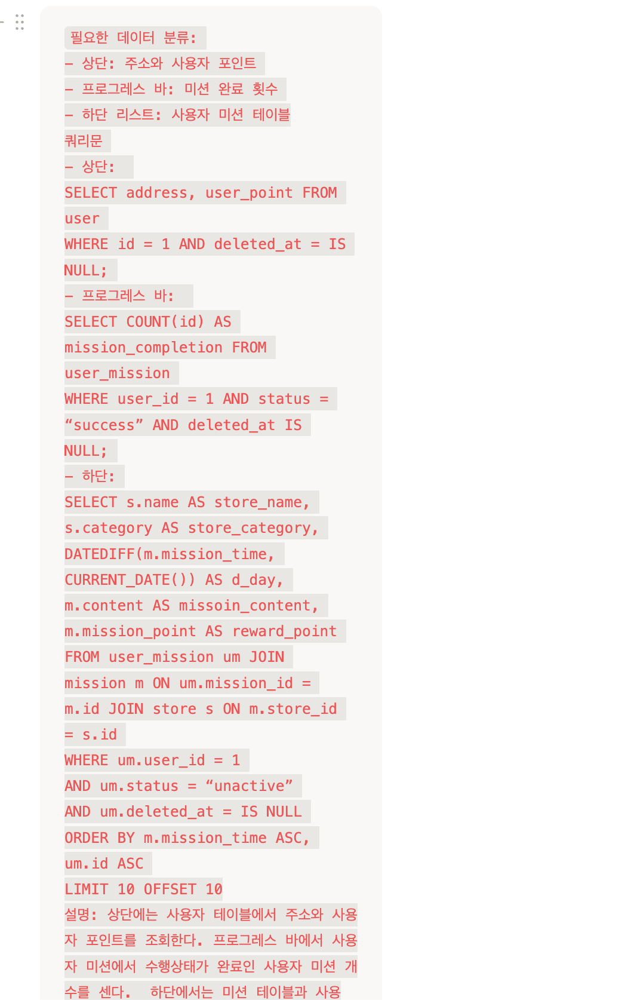

### 피어리뷰 (Spring A팀 미키)



**리뷰 내용**

1번 쿼리
- ERD 테이블 이름과 동일하게 REVEIW -> review로 변경하면 좋을 것 같아요!
- 위와 동일하게 모두 소문자로 변경하면 좋을 것 같아요!

2번 쿼리
- SQL문에서는 '로만 적는걸로 알고있는데 한 번 확인해주세요!!

3번 쿼리
- 저는 AS가 테이블 이름을 짧게 줄이는 기능만 있는줄 알았는데 별칭 기능도 있었군요!
- 제가 알기로는 SELECT, FROM, JOIN 모든 곳에서 AS 사용해도 되는 것으로 알고 있어서 mission AS m이 맞을 것 같아요!
- cursor paging 방법까지 쓰신게 인상깊어요!

4번 쿼리
- created_at()을 front에 넘기는게 아니라 직접 시간 넘겨주는게 멋있어요!

<hr>

### 1. 리뷰 작성하는 쿼리

- 리뷰 테이블에서 유저 id, 가게 id, 평점, 리뷰 내용을 입력 받는다

```sql
INSERT INTO reviews (user_id, store_id, star, content, created_at, updated_at)
VALUES (1, 1, 5, '좋습니다', NOW(), NOW())
```

### 2. 내가 진행중, 진행 완료한 미션 모아서 보는 쿼리(페이징 포함)

- 먼저 사용자 미션, 미션, 가게 테이블을 조인한다. 그리고 API 호출 시 입력 파라미터로 user_id로 미션 수행 상태인 status를 받도록 했다. (해당 인원의 미션 진행중, 진행완료를 알아야 되기 때문에) 가게의 id, 가게명, 미션 내용, 포인트를 선택했고 updated_at을 기준으로 내림차순 했다.
  페이징 기법은 offset 사용해서 한 페이지에 10개씩 조회되도록 했다.

```sql
SELECT s.id, s.name, m.condition, m.success_point, um.status
FROM user_missions AS um
JOIN missions AS m ON m.id = um.mission_id
JOIN stores AS s ON s.id = m.store_id
WHERE um.user_id = 1 AND um.status = 'SUCCESS'
ORDER BY um.updated_at DESC
LIMIT 10 OFFSET 0;
```

### 3. 마이 페이지 화면 쿼리

- users 테이블에서 profile_url, name, email, phone_check, point 가져온다

```sql
SELECT profile_url, name, email, phone_number, phone_check,point
FROM users
WHERE id = 1
```

### 4. 홈 화면 쿼리 (현재 선택 된 지역에서 도전이 가능한 미션 목록, 페이징 포함)


- '7/10' 부분 :  카운트 쿼리를 사용해서 ‘안암동’ 지역에서 선택한 나의 미션 중에서 성공한 미션의 개수를 센다

- 'MY MISSION' 부분 :  가게 이름, 미션 데드라인, 가게 카테고리, 미션 내용, 포인트가 필요하다. 또한 이 미션도 ‘안암동’ 지역에 대한 것이기 때문에 WHERE에 지역 조건을 추가한다. 정렬은 데드라인이 짧은 순으로 했다 또한 페이징 기법은 offset 사용해서 한 페이지에 10개씩 조회되도록 했다.

```sql
/* '7/10' 부분  */
SELECT COUNT(*)
FROM user_missions AS um
JOIN missions AS m ON m.id = um.mission_id
JOIN stores AS s ON s.id = m.store_id
JOIN regions AS r ON r.id = s.region_id
WHERE um.user_id = 1 AND um.status = 'SUCCESS' AND r.name = '안암동';

/* 'MY MISSION' 부분 */
SELECT s.name, s.category_id, m.deadline, m.condition, m.success_point
FROM missions AS m
JOIN stores AS s ON s.id = m.store_id
JOIN regions AS r ON r.id = s.region_id
LEFT JOIN user_missions AS um ON um.mission_id = m.id AND um.user_id = 1
WHERE r.name = '안암동' AND (um.status IS NULL OR um.status != 'SUCCESS')
ORDER BY m.deadline ASC;
LIMIT 10 OFFSET 0;
```
