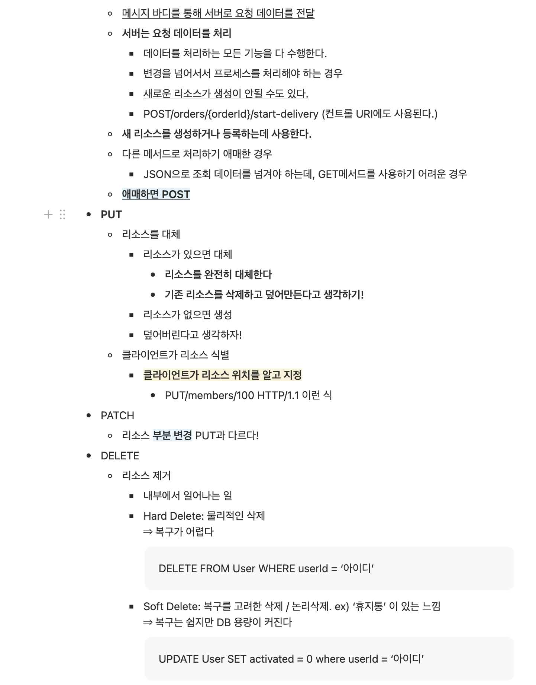

### 피어리뷰 (Spring A팀 미키)



**리뷰 내용**

Http Method에 대해 자세하면서 핵심만 정확하게 조사하게 좋은 것 같아요! 특히 Hard, Soft Delete까지 구분해서 설명해주신 점이 인상깊어요!

<hr>

### 1. 홈화면
- #### API Endpoint : GET /api/home
- #### Request Body : X
- #### Request Header :
    - Authorization: Bearer <token>
- #### Query Parameter

    ```json
    {
        "regionName" : "안암동" 
    }
    ```

- #### Path Variable : X
- #### Reponse Body

    ```json
    {
        "isSuccess": true,
        "code": "COMMON201",
        "message": "성공입니다.",
        "result": {
              "userPoint" : 999999,
              "missionCount" : 7,
              "missions" : [
                  {
                      "missionId" : 1,
                      "storeName" : "학생마라탕",
                      "missionContent" : "12000이상 식사",
                      "missionPoint" : 500,
                      "missionDeadline" : 7
                  },
                  {
                      "missionId" : 2,
                      "storeName" : "학생짜장면",
                      "missionContent" : "14000이상 식사",
                      "missionPoint" : 600,
                      "missionDeadline" : 3
                  }
              ],
            "pageSize": 1,
            "nextCursor": null,
            "hasNext": false
        },
        "timestamp": "2026-03-21T17:37:21"
    }
    ```
  
<hr>

### 2. 마이페이지 리뷰 작성
- #### API Endpoint : POST /api/stores/{storeId}/reviews
- #### Request Body

    ```json
    {
        "reviewContent" : "좋은데요?",
        "star" : 5,
        "photoUrl" : "~~~"
    }
    ```

- #### Request Header :
    - Content-Type : application/json
    - Authorization: Bearer <token>
- #### Query Parameter : X
- #### Path Variable

    ```json
    {
        "storeId" : 1
    }
    ```

- #### Reponse Body

    ```json
    {
        "isSuccess": true,
        "code": "COMMON201",
        "message": "성공입니다.",
        "result": {
                "reviewId" : 1
        },
        "timestamp": "2026-03-22T18:45:08"
    }
    ```

<hr>

### 3. 미션 목록 조회(진행중, 진행 완료)
- #### API Endpoint : GET /api/mypages/missions
- #### Request Body : X
- #### Request Header :
    - Authorization: Bearer <token>
- #### Query Parameter

    ```json
    {
        "regionName" : "안암동",
        "status" : "SUCCESS OR INPROGRESS"
    }
    ```

- #### Path Variable : X
- #### Reponse Body

    ```json
    {
        "isSuccess": true,
        "code": "COMMON200",
        "message": "성공입니다.",
        "result": {
              "userPoint" : 999999,
              "missionCount" : 7,
              "missions" : [
                  {
                      "missionId" : 1,
                      "storeId" : "1",
                      "storeName" : "학생마라탕",
                      "missionContent" : "12000이상 식사",
                      "missionPoint" : 500,
                      "missionDeadline" : 7
                  },
                  {
                      "missionId" : 2,
                      "storeId" : "2",
                      "storeName" : "학생짜장면",
                      "missionContent" : "14000이상 식사",
                      "missionPoint" : 600,
                      "missionDeadline" : 3
                  }
              ],
            "pageSize": 1,
            "nextCursor": null,
            "hasNext": false
        },
        "timestamp": "2026-03-22T17:37:21"
    }
    ```
  
<hr>

### 4. 미션 성공 누르기
- #### API Endpoint : PATCH /api/missions/{missionId}
- #### Request Body : X
- #### Request Header :
    - Content-Type : application/json
    - Authorization: Bearer <token>
- #### Query Parameter : X
- #### Path Variable :

    ```json
    {
        "missionId" : 1
    }
    ```

- #### Reponse Body

    ```json
    {
        "isSuccess": true,
        "code": "COMMON200",
        "message": "성공입니다.",
        "result": {
                "missionId" : 1
        },
        "timestamp": "2026-03-22T18:45:08"
    }
    ```

### 5. 회원 가입하기
- #### API Endpoint : POST /auth/signup
- #### Request Body :

    ```json
    {
        "terms" : [
            {"termId" : 1, "isAgree" : true},
            {"termId" : 2, "isAgree" : true},
            {"termId" : 3, "isAgree" : true},
            {"termId" : 4, "isAgree" : true}
        ],
        "name" : "주니",
        "gender" : "male",
        "birth" : "2003-02-07",
        "address" : "인천 경인남길 30번길",
        "favoriteFoods" : ["1", "4"]
    }
    ```

- #### Request Header :
    - Content-Type : application/json
- #### Query Parameter : X
- #### Path Variable : X
- #### Reponse Body

    ```json
    {
      "isSuccess": true,
      "code": "COMMON200",
      "message": "성공적으로 회원가입이 완료되었습니다.",
      "timestamp": "2026-03-22T12:46:16.932Z"
    }
    ```