### 부록 1

#### 1. SpringApplication.run 실행 시 refreshContext가 호출되며 빈 생성이 시작됨.
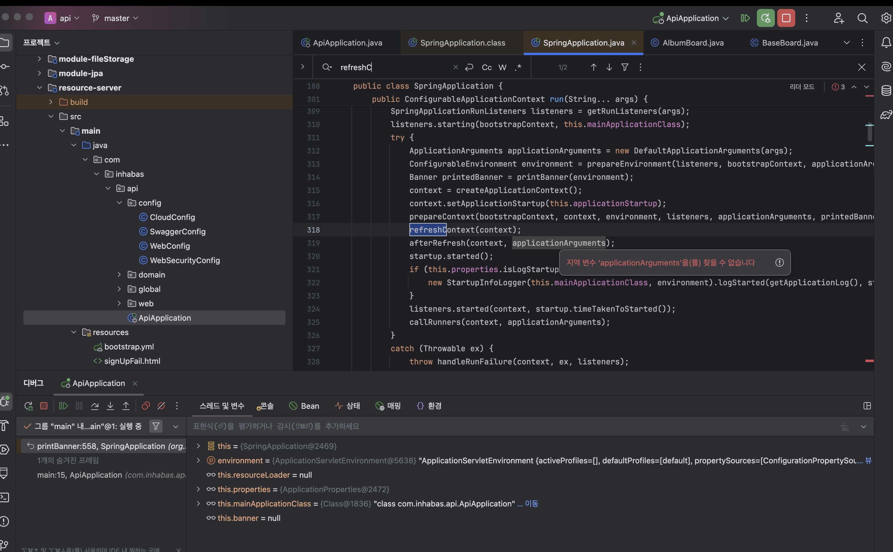

- refreshContext : 여기서 모든 빈(Bean)들이 생성되고 조립.

#### 2. AbstractAutowireCapableBeanFactory가 실질적인 생성 권한을 위임받음.
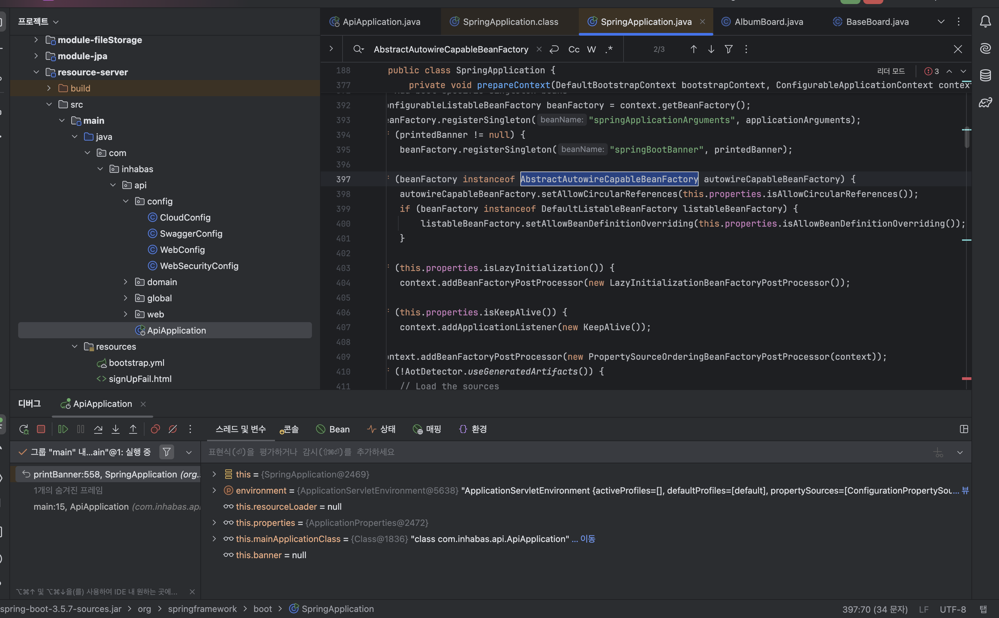

#### 3. doCreateBean 메서드에 진입하며 개별 빈들이 하나씩 생성됨. (인스턴스화)
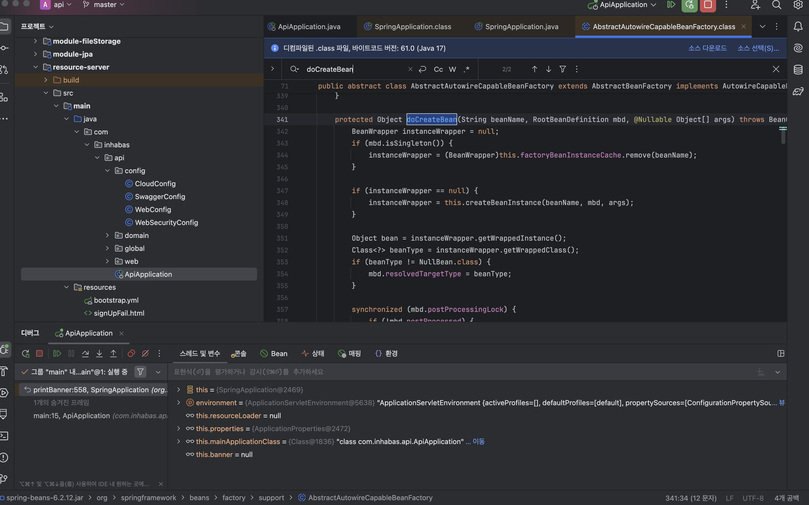

#### 4. 생성된 빈은 populateBean에서 의존성을 주입받고, initializeBean에서 프록시(AOP) 처리됨.
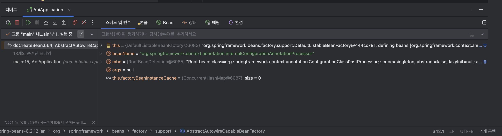

#### 5. 프레임워크 내부 빈(Processor 등) → 라이브러리 빈(Cloud 등) → 사용자 정의 빈 순으로 생성됨을 디버깅으로 확인 완료
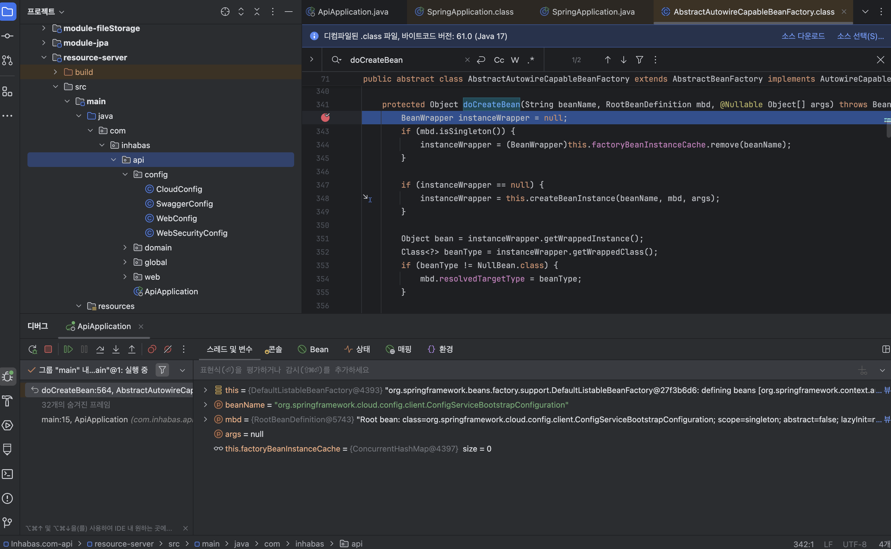

### 부록 3

`VirtualFilterChain`을 거쳐야 하나요?

- 서블릿 컨테이너(Tomcat)가 기본적으로 제공하는 `FilterChain`이 있는데, 스프링 시큐리티는 왜 굳이 자기들만의 **'가상 필터 체인(Virtual)'**을 따로 만들었을까요?

- **관심사의 분리:** 톰캣 입장에서는 스프링 시큐리티 필터가 10개든 100개든 그냥 '스프링이 등록한 큰 필터 하나'(`FilterChainProxy`)로 보입니다. 스프링 시큐리티 내부의 복잡한 보안 로직을 톰캣의 일반 필터들과 섞이지 않게 **격리해서 관리**하기 위함입니다.
- **유연한 체인 선택:** 요청 URL에 따라 다른 보안 정책(예: `/api`는 JWT, `/admin`은 세션)을 적용해야 하는데, `VirtualFilterChain`이 있어야 내가 만든 여러 개의 `SecurityFilterChain` 중 **딱 맞는 필터 뭉치**만 골라서 실행할 수 있습니다.

`VirtualFilterChain`의 역할

- **진행 관리자:** 시큐리티 필터 목록(보통 15개 내외)을 가지고 있으면서, 현재 몇 번째 필터를 실행할 차례인지(`currentPosition`) 관리합니다.
- **다리 역할:** 모든 시큐리티 필터가 무사히 끝나면, 다시 톰캣의 원래 필터 체인(`originalChain`)으로 제어권을 돌려주어 실제 컨트롤러까지 요청이 도달하게 합니다.

#### 1. FilterChainProxy의 doFilterInternal 메서드 찾는다. 보안 검문이 시작되는 장소
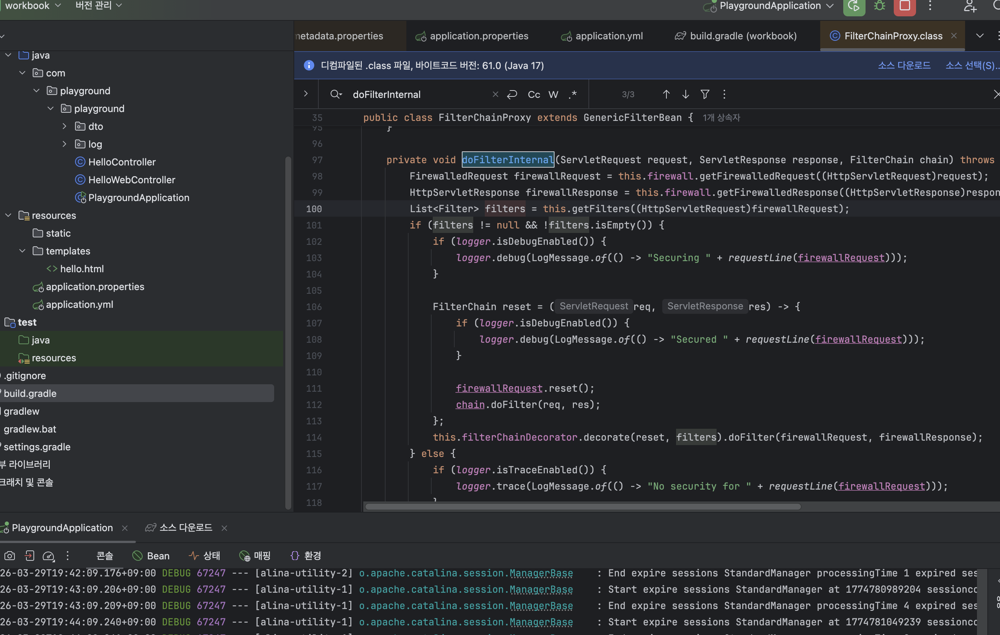

#### 2. doFilter는 무한 루프 방지 및 순서 관리자 역할
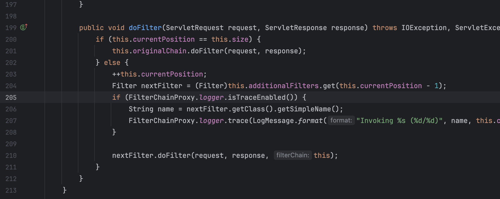

#### 3. doFilter와 filterChainDecorator 디버깅 찍음
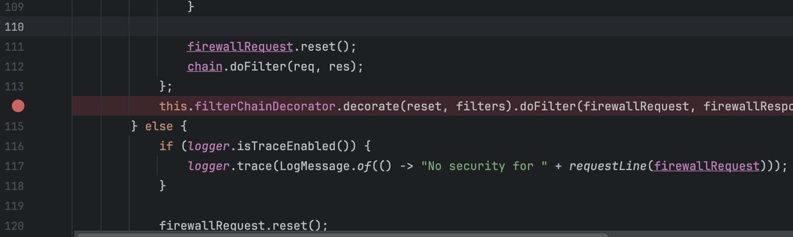

#### 4. ExceptionTranslationFilter가 /hello에 접속하려고 했지만 로그인 안됐다고 판단하고 로그인 창 띄움
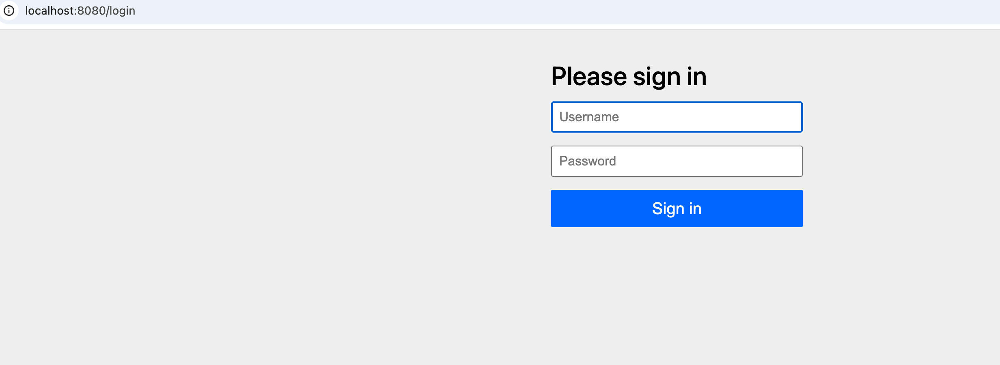
- **왜 그런가 (Why):** 지금 `/hello`라고 쳤는데 왜 `/login`이 떴을까요? 바로 `VirtualFilterChain`에 들어있는 `AuthorizationFilter`나 `ExceptionTranslationFilter`가 "어? 이 사람 로그인 안 했네? 로그인 페이지로 보내버려!"라고 판단했기 때문입니다.
- **역할 (Role):** `VirtualFilterChain`은 수많은 필터들을 하나씩 실행하다가, 인증되지 않은 사용자를 감지하면 흐름을 가로채서 이 로그인 화면을 보여주는 필터(`DefaultLoginPageGeneratingFilter`)를 동작시킵니다.

| **단계** | **이미지 속 위치** | **일어나는 일** |
| --- | --- | --- |
| **입구** | `FilterChainProxy` 98라인 | 요청을 분석하고 필요한 보안 필터 목록을 준비함. |
| **실행** | `VirtualFilterChain` 210라인 | 필터들을 하나씩 순서대로 실행하며 보안 검사를 진행함. |
| **차단** | 로그인 결과 화면 | 인증이 안 된 경우, 특정 필터가 흐름을 끊고 로그인 페이지로 보냄. |
| **통과** | `VirtualFilterChain` 201라인 | 모든 검사가 끝나면 `originalChain`을 통해 실제 서비스 로직으로 진입. |

### 부록 4

#### 1. 사용자의 요청이 컨트롤러에 도착
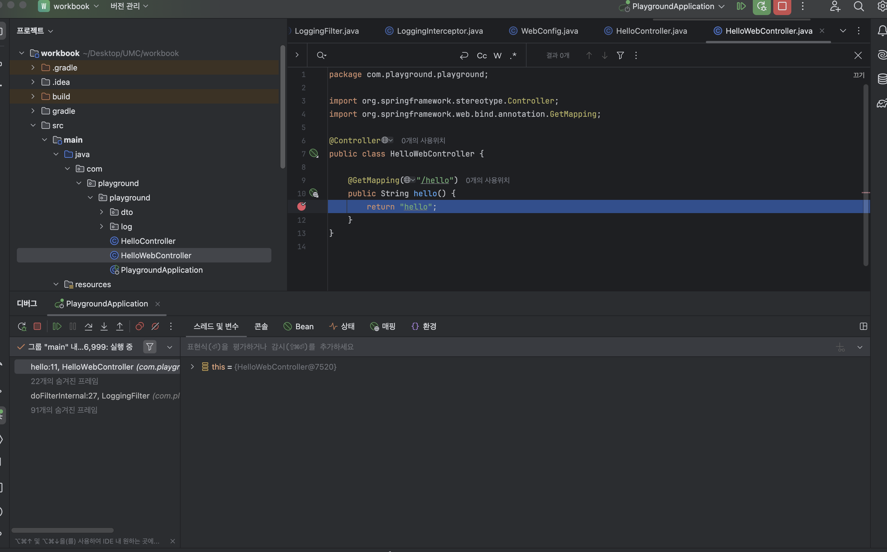

#### 2. 스프링의 DispatcherServlet이 컨트롤러에게 일을 시키기 바로 직전
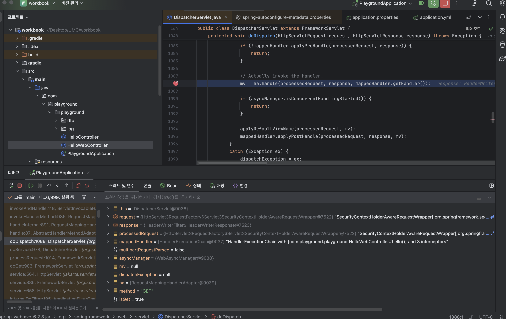

#### 3. 컨트롤러가 일을 마치고 돌아왔을 때, 어댑터가 그 결과를 낚아챈 순간
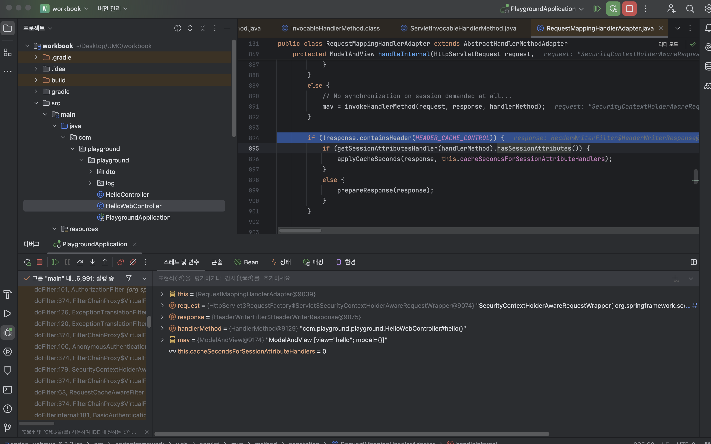

**1. ModelAndView의 작동 원리 확인**

- 컨트롤러(`HelloWebController`)가 실행을 마치면, `RequestMappingHandlerAdapter`가 그 결과를 낚아챕니다.
- 리턴값인 `"hello"`를 그냥 내버려 두지 않고, `ModelAndView`라는 가방(Container)을 만들어서 그 안에 `"hello"`를 쏙 집어넣습니다.

**2. HTML 컨트롤러와 JSON 컨트롤러의 차이점**

- **HTML (@Controller):** 보시는 것처럼 `ModelAndView` 객체가 생성되어 `DispatcherServlet`에게 전달됩니다. 이후 이 가방을 들고 **View Resolver**를 찾아가 화면을 그립니다.
- **JSON (@RestController):** `MessageConverter`가 응답을 바로 써버리기 때문에, 이 `mav` 변수가 `null`이 됩니다.

| **과정** | **수행 주체** | **역할** |
| --- | --- | --- |
| **요청 수신** | `DispatcherServlet` | 모든 요청을 받아 적절한 컨트롤러를 찾아 연결함. |
| **로직 실행** | `HelloWebController` | 비즈니스 로직을 처리하고 **View 이름**을 반환함. |
| **객체 생성** | `HandlerAdapter` | 컨트롤러의 리턴값을 받아 **`ModelAndView`** 가방을 만듦. (3번 사진) |
| **화면 탐색** | `ViewResolver` | 가방에 담긴 `"hello"`를 보고 실제 `hello.html` 파일을 찾음. |
| **최종 응답** | `View` | 모델 데이터와 HTML을 합쳐 브라우저에 뿌려줌. |

