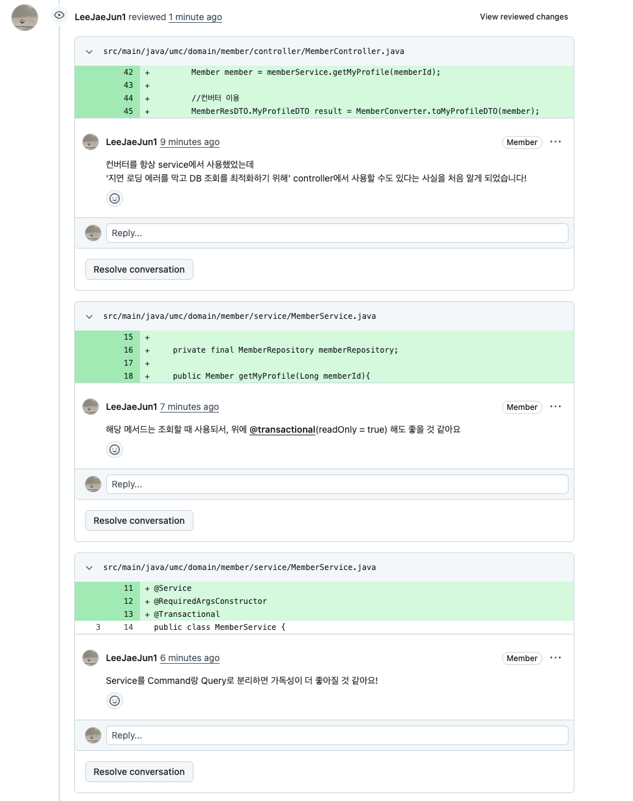
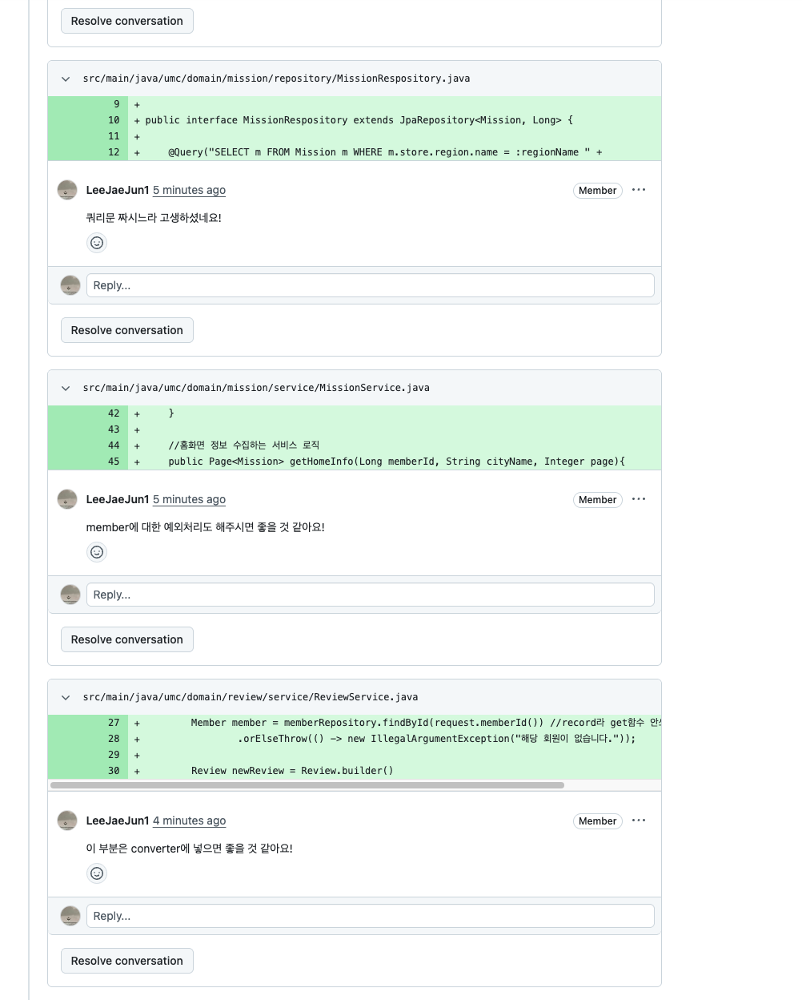
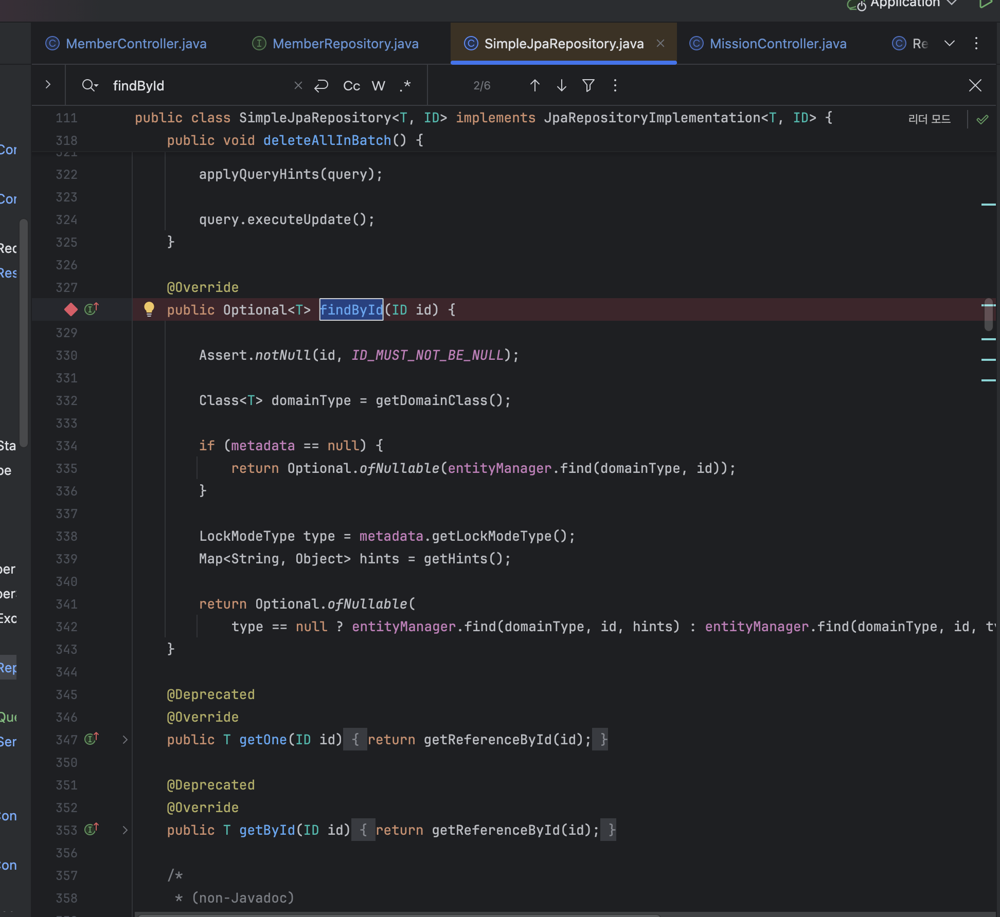
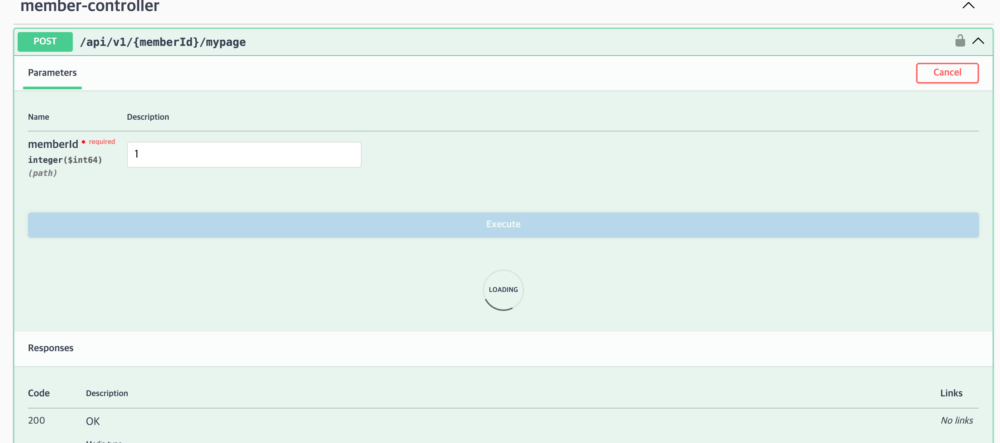
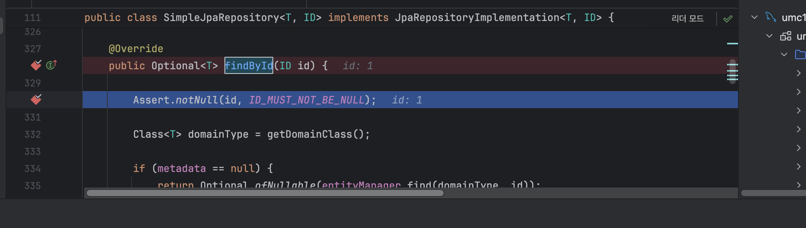
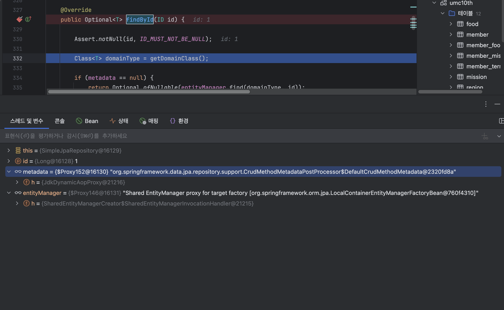
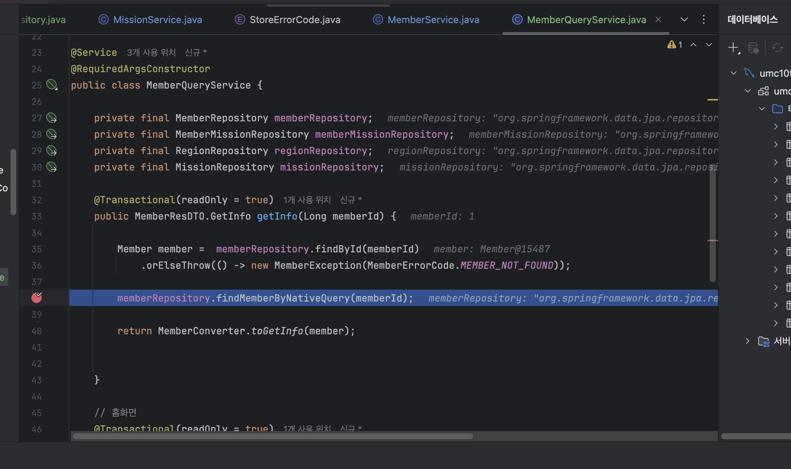

### 피어리뷰 (Spring A팀 미키)

### 간단한 JPA Repository 메서드 실행부분에 디버깅 포인트 찍어보면서 디버깅하기

- 프록시를 무시히 통과해서 도달한 진짜 구현체

- **`id = 1`:** 우리가 파라미터로 넘긴 값(1번 회원)이 잘 들어왔습니다.
- **`entityManager`:** `Optional.ofNullable(entityManager.find(...))` 코드를 실행하기 위해 대기 중인 엔티티 매니저입니다.
- sharedEntity ~~ : 1차 캐시를 관리하는데 사용. EntityHolder 뒤져서 있는지 없는지 확인

### NativeQuery 생성하고 디버깅 포인트 찍어보면서 디버깅하기

- 네이티비 쿼리 디버깅 위해 서비스 로직에 포인트 찍고 F7 눌렀더니 PartTree 쿼리 만들 필요없이 바로 실행.

- `memberRepository.findById()`를 호출했을 때, 가장 먼저 실행된 가짜 객체(프록시)
- `MemberRepository`는 우리가 구현체(클래스) 없이 인터페이스로만 만듬. 자바에서는 인터페이스가 스스로 일을 할 수 없기 때문에, 스프링이 런타임에 몰래 이 `JdkDynamicAopProxy`라는 문지기를 세워둡니다.

